# 前提
以下で自動取得した証明書をEC2のApache/Nginx上に自動で適用する方式を考えてみます。
内容としてはスクリプトを用意して、Cronにそのスクリプトを回してもらう事で証明書の更新を自動化したいと思います。

[[ssl-cert-short-lifetime-acme-dns01-lambda]]

# 環境イメージ

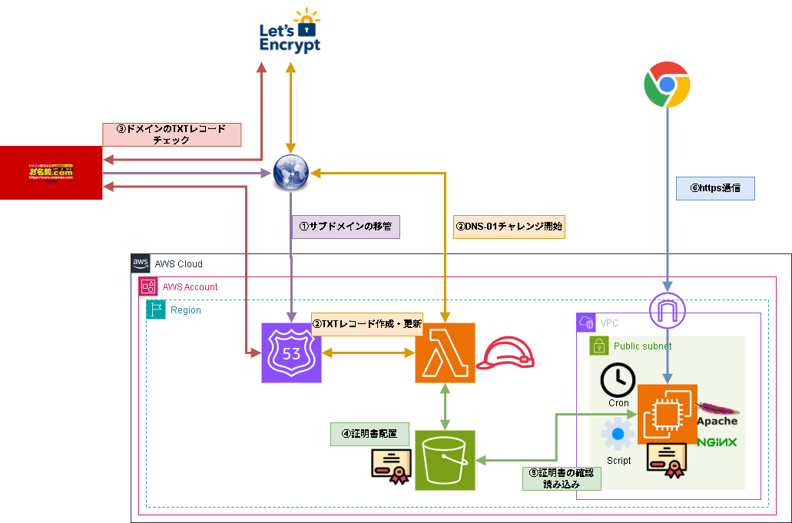

# 用語
## aws s3 sync
S3とローカルの差分があるファイルだけをダウンロードするコマンド。更新がなければ何もしない。この記事の仕組みの核心で、Lambdaが証明書を更新してS3に上書きした場合のみダウンロードが走る。

## IAM Role（インスタンスプロファイル）
EC2にAWSサービスへのアクセス権を付与する仕組み。アクセスキーをサーバ上に置く必要がなくなるため、キーの漏洩リスクを排除できる。

※Felo AIで生成。一部文字がシャギーですが治らないので…💦
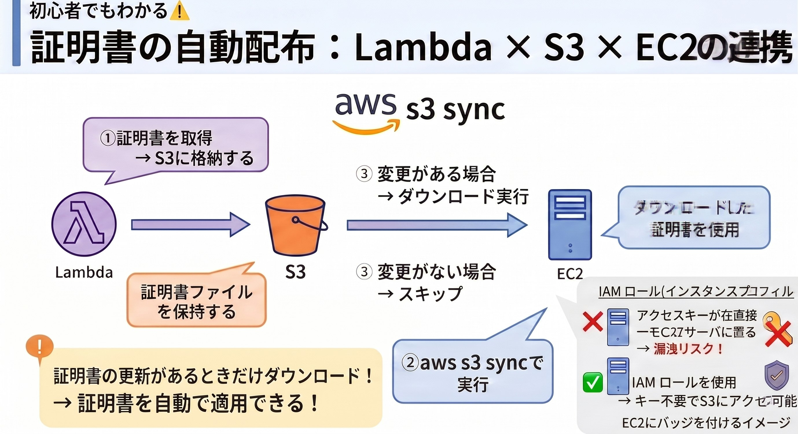

## mod_ssl
ApacheでSSL/TLSを有効にするためのモジュール。これをインストールすることでApacheがHTTPS通信を処理できるようになる。

## VirtualHost
Apacheで1台のサーバ上に複数のサイトを運用するための設定単位。ポートやドメイン名ごとに異なる設定を適用できる。

## systemctl reload vs restart
`reload` は設定ファイルを再読み込みするだけで既存の接続を切らない。`restart` は一度サービスを停止してから再起動するため、接続中のユーザに影響が出る。証明書更新時に `reload` を使っているのはサービス断を避けるため。

※Felo AIで生成
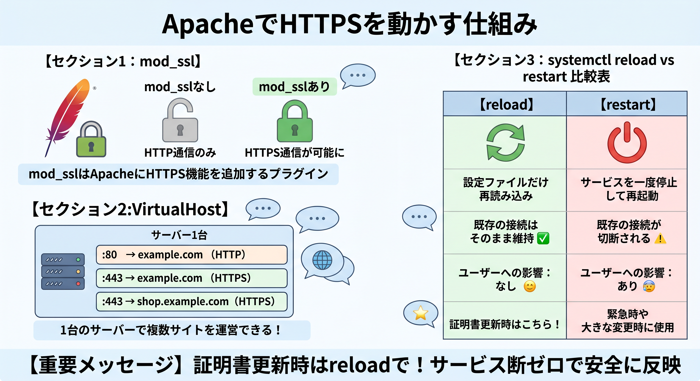

# 手順
## 検証用サーバの準備
今回の検証用サーバはEC2（RHEL9）で構築します。
インスタンスタイプはt3.micro。Diskはデフォルトの10GB。
SGはSSH,HTTP,HTTPS。パブリックサブネットに立ち上げます。
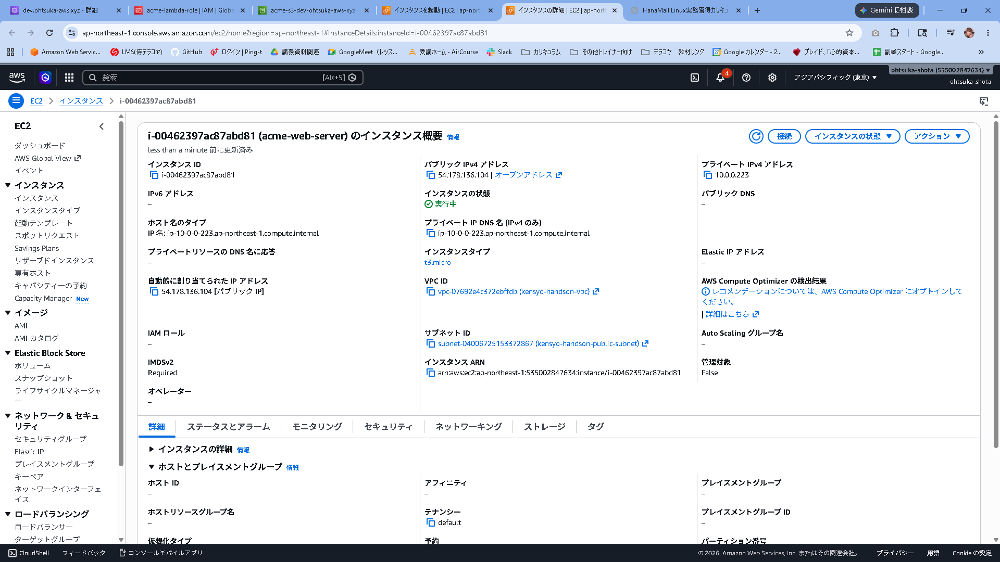

このEC2からS3に対して証明書を取得するようにしたいので、EC2にS3へのアクセス権を設定する必要があります。
その為のIAM Roleを作る必要があります。AWSのサービスからEC2を選択して次に進みます。
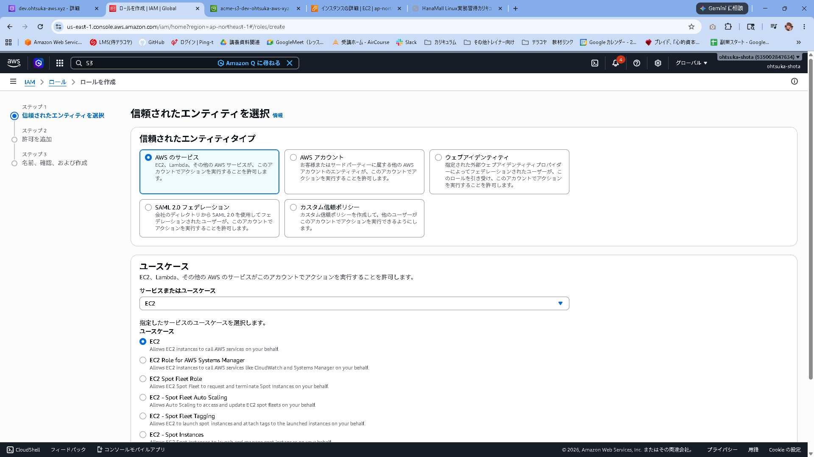

Roleの名前はacme-ec2-roleとしました。S3FullAccessポリシをアタッチして作成します。
※本番環境時はS3を指定して、データの取得だけ出来るように調整するのが良いでしょう。
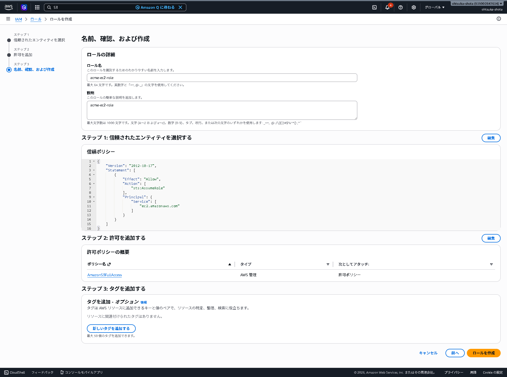

立ち上げたEC2にアタッチします。
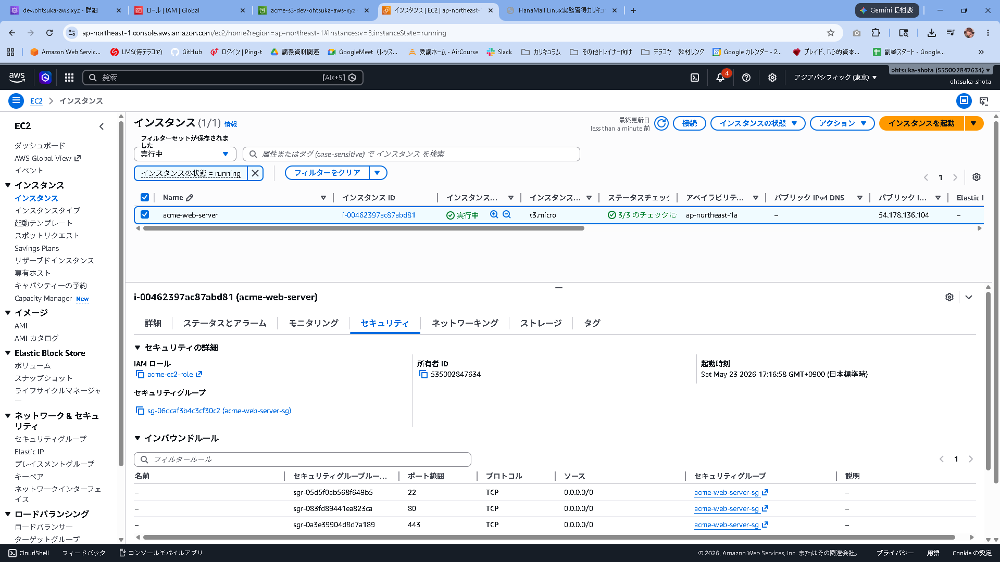

EC2にSSH接続し、AWS CLIをインストールします。
インストール後、aws --versionと実行して出力がかえってくればインストールは成功です。
```
[ec2-user@ip-10-0-0-223 ~]$ sudo su -
[root@ip-10-0-0-223 ~]# dnf update && dnf upgrade -y
[root@ip-10-0-0-223 ~]# curl "https://awscli.amazonaws.com/awscli-exe-linux-x86_64.zip" -o "awscliv2.zip"
[root@ip-10-0-0-223 ~]# dnf install -y unzip
[root@ip-10-0-0-223 ~]# unzip awscliv2.zip
[root@ip-10-0-0-223 ~]# ./aws/install
You can now run: /usr/local/bin/aws --version
[root@ip-10-0-0-223 ~]# aws --version
aws-cli/2.34.53 Python/3.14.5 Linux/5.14.0-611.49.1.el9_7.x86_64 exe/x86_64.rhel.9
```

https://docs.aws.amazon.com/ja_jp/cli/latest/userguide/getting-started-install.html#getting-started-install-instructions

## Httpd(Apache2)
### 環境構築
Apacheをインストールします。
```
[root@ip-10-0-0-223 ~]# dnf install -y httpd
[root@ip-10-0-0-223 ~]# systemctl start httpd
```
WebブラウザにEC2にアクセスして以下のようなページが表示されればインストール成功です。
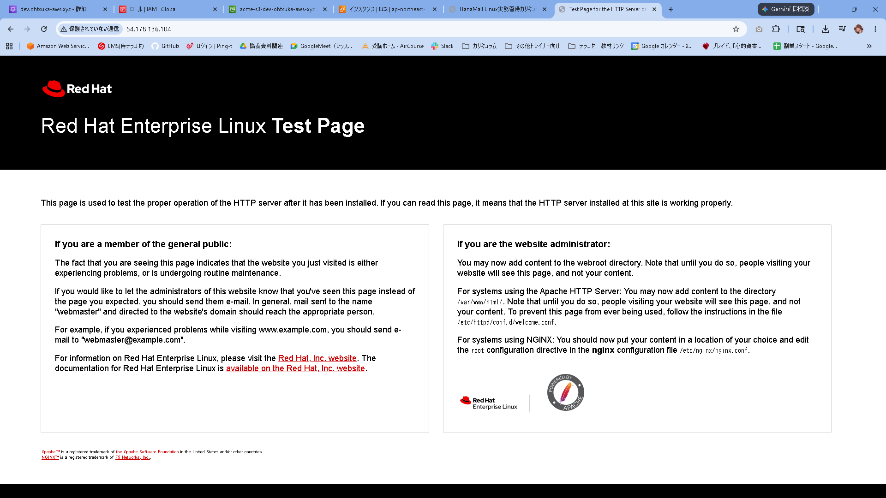

次にmod_sslをインストールします。
SSL化するためです。
```
[root@ip-10-0-0-223 ~]# dnf install -y mod_ssl
```

証明書を配置するためのディレクトリを作成します。
```
[root@ip-10-0-0-223 ~]# mkdir -p /etc/pki/tls/certs/dev.ohtsuka-aws.xyz
```

証明書を取得・更新するためのスクリプトを用意します。
```
[root@ip-10-0-0-223 ~]# vi /usr/local/bin/update_cert.sh
[root@ip-10-0-0-223 ~]# cat /usr/local/bin/update_cert.sh
#!/bin/bash

# 変数定義
S3_URI="s3://acme-s3-dev-ohtsuka-aws-xyz/certificates/dev.ohtsuka-aws.xyz/"
CERT_DIR="/etc/pki/tls/certs/dev.ohtsuka-aws.xyz/"
LOG_FILE="/var/log/cert_update.log"

# コマンドのフルパスを指定（Cron実行時のエラー防止）
AWS_CMD="/usr/local/bin/aws"
SYSTEMCTL_CMD="/usr/bin/systemctl"

# S3から同期を実行し、その出力結果を変数に格納する
SYNC_RESULT=$($AWS_CMD s3 sync ${S3_URI} ${CERT_DIR})

# 出力結果が空でない（＝何かしらのファイルがダウンロード・更新された）場合のみ処理を行う
if [ -n "$SYNC_RESULT" ]; then
    # 秘密鍵の権限を安全な状態（rootのみ読み書き可能）に設定
    chmod 600 ${CERT_DIR}privkey.pem

    # Apacheをリロードして新しい証明書を反映
    $SYSTEMCTL_CMD reload httpd

    # ログに記録
    echo "$(date): 証明書を更新し、Apacheをリロードしました。" >> ${LOG_FILE}
    echo "${SYNC_RESULT}" >> ${LOG_FILE}
fi
[root@ip-10-0-0-223 ~]# chmod +x /usr/local/bin/update_cert.sh
[root@ip-10-0-0-223 ~]# ls -ltr /usr/local/bin/update_cert.sh
-rwxr-xr-x. 1 root root 863 May 23 08:51 /usr/local/bin/update_cert.sh
```

ApacheのSSL設定を行います。
```
[root@ip-10-0-0-223 ~]# vi /etc/httpd/conf.d/dev.ohtsuka-aws.xyz.conf
[root@ip-10-0-0-223 ~]# cat /etc/httpd/conf.d/dev.ohtsuka-aws.xyz.conf
<VirtualHost *:443>
    ServerName dev.ohtsuka-aws.xyz
    DocumentRoot /var/www/html

    SSLEngine on
    # スクリプトでダウンロードした証明書のパスを指定
    SSLCertificateFile /etc/pki/tls/certs/dev.ohtsuka-aws.xyz/fullchain.pem
    SSLCertificateKeyFile /etc/pki/tls/certs/dev.ohtsuka-aws.xyz/privkey.pem

    <Directory "/var/www/html">
        AllowOverride All
        Require all granted
    </Directory>
</VirtualHost>
```

Apacheに上記設定ファイルを読み込ませます。
エラーになりますが、まだS3から証明書を持ってきてない為のエラーになります。
```
[root@ip-10-0-0-223 ~]# apachectl configtest
AH00526: Syntax error on line 7 of /etc/httpd/conf.d/dev.ohtsuka-aws.xyz.conf:
SSLCertificateFile: file '/etc/pki/tls/certs/dev.ohtsuka-aws.xyz/fullchain.pem' does not exist or is empty
[root@ip-10-0-0-223 ~]# systemctl restart httpd
Job for httpd.service failed because the control process exited with error code.
See "systemctl status httpd.service" and "journalctl -xeu httpd.service" for details.
```

### 動作確認
スクリプトを初回実行します。
"httpd.service is not active, cannot reload."みたいなエラーが出ますが、想定内です。
改めてApacheをstartすると起動します。またこのタイミングでログを核にすると証明書を更新したという内容が出力されます。
```
[root@ip-10-0-0-223 ~]# /usr/local/bin/update_cert.sh
httpd.service is not active, cannot reload.
[root@ip-10-0-0-223 ~]# systemctl start httpd
[root@ip-10-0-0-223 ~]# systemctl status httpd
● httpd.service - The Apache HTTP Server
     Loaded: loaded (/usr/lib/systemd/system/httpd.service; disabled; preset: disabled)
     Active: active (running) since Sat 2026-05-23 08:59:01 UTC; 10s ago
       Docs: man:httpd.service(8)
   Main PID: 20109 (httpd)
[root@ip-10-0-0-223 ~]# cat /var/log/cert_update.log
Sat May 23 09:13:00 AM UTC 2026: 証明書を更新し、Apacheをリロードしました。
download: s3://acme-s3-dev-ohtsuka-aws-xyz/certificates/dev.ohtsuka-aws.xyz/privkey.pem to ../etc/pki/tls/certs/dev.ohtsuka-aws.xyz/privkey.pem
download: s3://acme-s3-dev-ohtsuka-aws-xyz/certificates/dev.ohtsuka-aws.xyz/fullchain.pem to ../etc/pki/tls/certs/dev.ohtsuka-aws.xyz/fullchain.pem
```

改めてEC2にWebブラウジング（https）すると以下のように証明書を読み込んでいるのを確認できます。
※証明書のドメインを読み込めていますが、IPアドレスでアクセスしているのでURIに警告が出ていますが、想定内です。
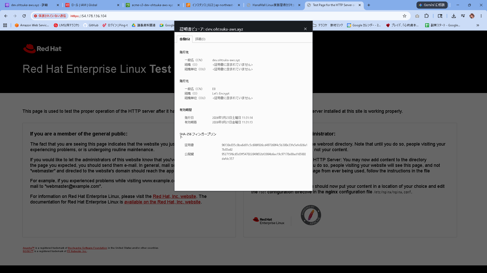

Route53にAレコードを作成して、EC2のIPアドレスを指定します。
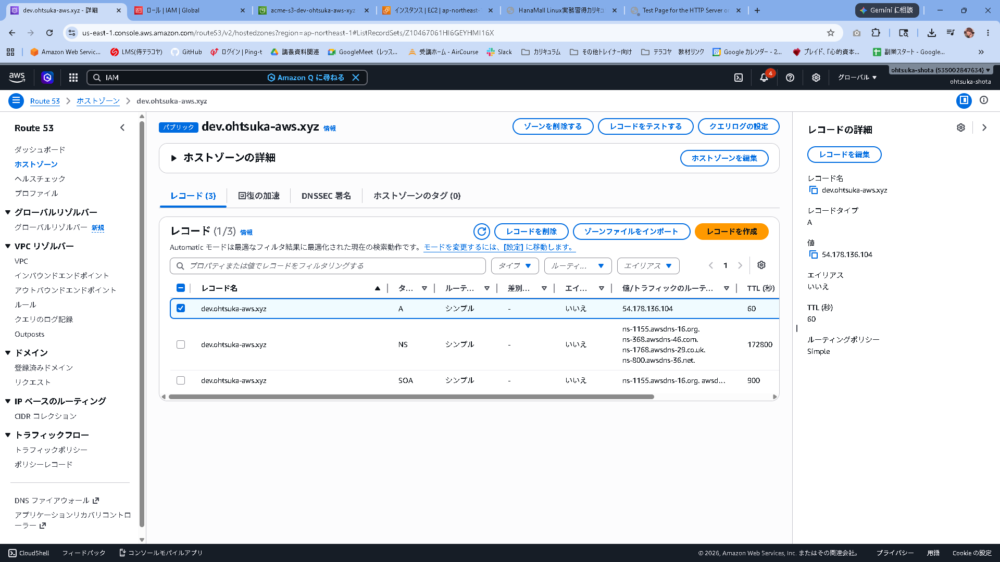

https\://サーバのドメイン名でWebブラウジングをすると先ほどのURIへの警告が表示されません。
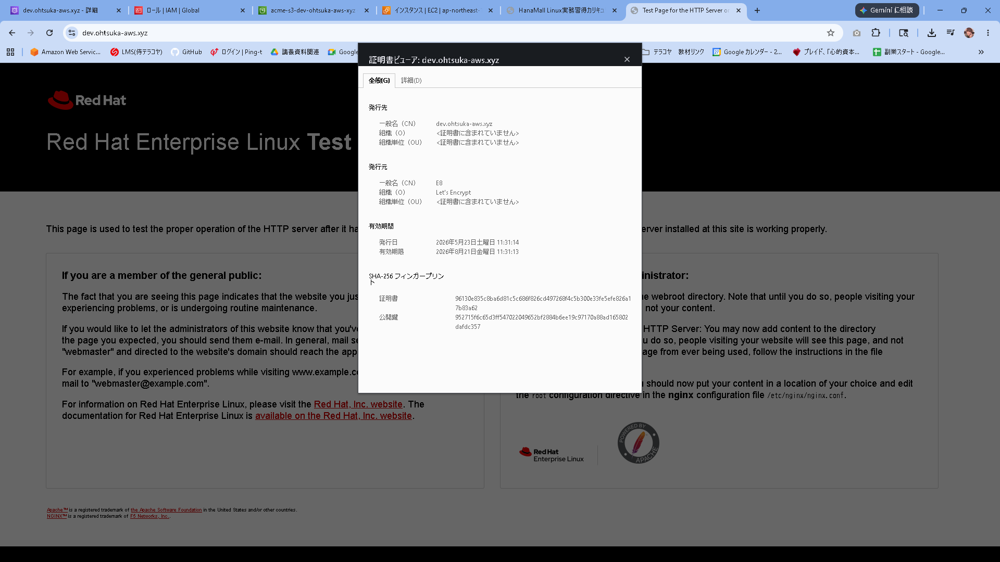

スクリプトを何度か実行してみます。
ログに更新がされていないので、S3から引っ張ってきてないことがわかります。
```
[root@ip-10-0-0-223 ~]# /usr/local/bin/update_cert.sh
[root@ip-10-0-0-223 ~]# /usr/local/bin/update_cert.sh
[root@ip-10-0-0-223 ~]# /usr/local/bin/update_cert.sh
[root@ip-10-0-0-223 ~]#
[root@ip-10-0-0-223 ~]# cat /var/log/cert_update.log
Sat May 23 09:13:00 AM UTC 2026: 証明書を更新し、Apacheをリロードしました。
download: s3://acme-s3-dev-ohtsuka-aws-xyz/certificates/dev.ohtsuka-aws.xyz/privkey.pem to ../etc/pki/tls/certs/dev.ohtsuka-aws.xyz/privkey.pem
download: s3://acme-s3-dev-ohtsuka-aws-xyz/certificates/dev.ohtsuka-aws.xyz/fullchain.pem to ../etc/pki/tls/certs/dev.ohtsuka-aws.xyz/fullchain.pem
```

### 処理フローのイメージ
処理フローのイメージは以下です。
- Lambdaが新しい証明書を取得し、S3にアップロード（上書き）する。
- S3上のファイルの「更新日時」が新しくなる。
- Cronでこのスクリプトが走り、aws s3 sync が「S3の方が新しい！」と検知してダウンロードを実行する。
- ダウンロードが実行されると、標準出力に download: s3://... という文字列が出力される。
- 変数 SYNC_RESULT にその文字列が格納されるため、if [ -n "$SYNC_RESULT" ]（中身が空じゃない場合）の条件を満たし、Apacheのリロードが走る。

Cronのサンプル
```
# 例：毎日午前3時に実行
0 3 * * * /usr/local/bin/update_cert.sh
```

### 環境削除
Nginxでも試してみたいので、Apacheの環境はここで削除します。
```
[root@ip-10-0-0-223 ~]# systemctl stop httpd
[root@ip-10-0-0-223 ~]# dnf remove -y httpd httpd-tools mod_ssl
Complete!
[root@ip-10-0-0-223 ~]# rm -rf /etc/httpd
```

## Nginx
### 環境構築
Nginxをインストールして起動します。
```
[root@ip-10-0-0-223 ~]# dnf install -y nginx
[root@ip-10-0-0-223 ~]# systemctl start nginx
```

WebブラウザでEC2にアクセスします。
Apacheの時とあまり違いが無いようですが、Nginxという表記が右下にあればOKです。
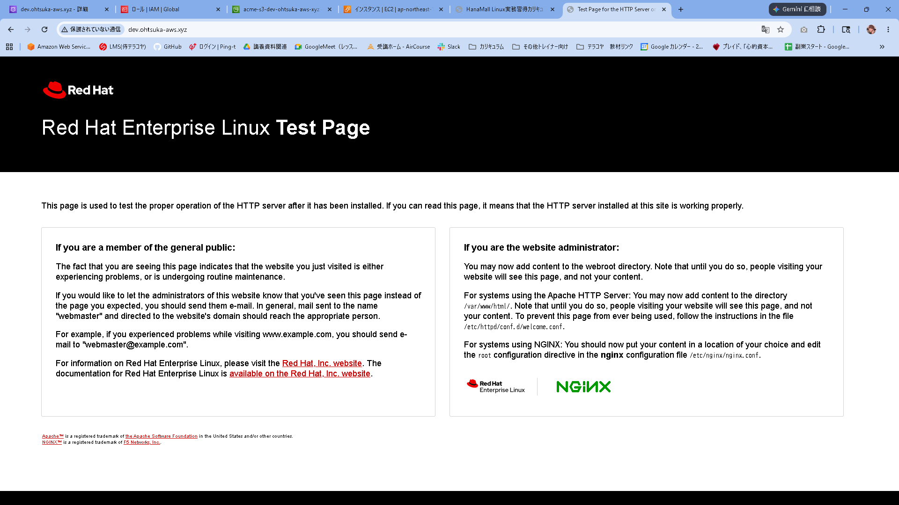

スクリプトの内容を書き換えます。
とはいってもApacheという表記をNginxという表記に買えただけですが。。。
```
[root@ip-10-0-0-223 ~]# vi /usr/local/bin/update_cert.sh
[root@ip-10-0-0-223 ~]# cat /usr/local/bin/update_cert.sh
#!/bin/bash

# 変数定義
S3_URI="s3://acme-s3-dev-ohtsuka-aws-xyz/certificates/dev.ohtsuka-aws.xyz/"
CERT_DIR="/etc/pki/tls/certs/dev.ohtsuka-aws.xyz/"
LOG_FILE="/var/log/cert_update.log"

# コマンドのフルパスを指定（Cron実行時のエラー防止）
AWS_CMD="/usr/local/bin/aws"
SYSTEMCTL_CMD="/usr/bin/systemctl"

# S3から同期を実行し、その出力結果を変数に格納する
SYNC_RESULT=$($AWS_CMD s3 sync ${S3_URI} ${CERT_DIR})

# 出力結果が空でない（＝何かしらのファイルがダウンロード・更新された）場合のみ処理を行う
if [ -n "$SYNC_RESULT" ]; then
    # 秘密鍵の権限を安全な状態（rootのみ読み書き可能）に設定
    chmod 600 ${CERT_DIR}privkey.pem

    # Nginxをリロードして新しい証明書を反映
    $SYSTEMCTL_CMD reload nginx

    # ログに記録
    echo "$(date): 証明書を更新し、Nginxをリロードしました。" >> ${LOG_FILE}
    echo "${SYNC_RESULT}" >> ${LOG_FILE}
fi
```

Nginxの設定をファイルを編集していきます。
```
[root@ip-10-0-0-223 ~]# vi /etc/nginx/conf.d/dev.ohtsuka-aws.xyz.conf
[root@ip-10-0-0-223 ~]# cat /etc/nginx/conf.d/dev.ohtsuka-aws.xyz.conf
# HTTP (80番ポート) のアクセスを HTTPS にリダイレクトする設定
server {
    listen 80;
    server_name dev.ohtsuka-aws.xyz;

    return 301 https://$host$request_uri;
}

# HTTPS (443番ポート) の設定
server {
    listen 443 ssl;
    server_name dev.ohtsuka-aws.xyz;

    # Nginxのデフォルトドキュメントルートを使用する場合
    root /usr/share/nginx/html;
    index index.html index.htm;

    # S3からダウンロードした証明書のパスを指定
    ssl_certificate     /etc/pki/tls/certs/dev.ohtsuka-aws.xyz/fullchain.pem;
    ssl_certificate_key /etc/pki/tls/certs/dev.ohtsuka-aws.xyz/privkey.pem;

    # セキュリティを高めるための推奨SSL設定
    ssl_protocols TLSv1.2 TLSv1.3;
    ssl_ciphers HIGH:!aNULL:!MD5;
    ssl_prefer_server_ciphers on;

    location / {
        try_files $uri $uri/ =404;
    }
}
```


### 動作確認
スクリプトを実行します。
ログを確認した結果証明書をインストールして適用していることがわかります。
```
[root@ip-10-0-0-223 ~]# /usr/local/bin/update_cert.sh
[root@ip-10-0-0-223 ~]# cat /var/log/cert_update.log
Sat May 23 10:17:36 AM UTC 2026: 証明書を更新し、Nginxをリロードしました。
download: s3://acme-s3-dev-ohtsuka-aws-xyz/certificates/dev.ohtsuka-aws.xyz/fullchain.pem to ../etc/pki/tls/certs/dev.ohtsuka-aws.xyz/fullchain.pem
download: s3://acme-s3-dev-ohtsuka-aws-xyz/certificates/dev.ohtsuka-aws.xyz/privkey.pem to ../etc/pki/tls/certs/dev.ohtsuka-aws.xyz/privkey.pem
```

https\://ドメイン名でアクセスすると証明書を読み込んでいることがわかります。
問題なさそうですね。
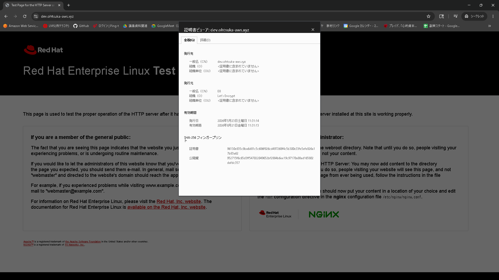

何度か実行してもS3に更新がかかっていないので、ダウンロードなど行っていないことがわかります。
処理フローはApacheの時と同様です。
```
[root@ip-10-0-0-223 ~]# /usr/local/bin/update_cert.sh
[root@ip-10-0-0-223 ~]# /usr/local/bin/update_cert.sh
[root@ip-10-0-0-223 ~]# /usr/local/bin/update_cert.sh
[root@ip-10-0-0-223 ~]#
[root@ip-10-0-0-223 ~]# cat /var/log/cert_update.log
Sat May 23 10:17:36 AM UTC 2026: 証明書を更新し、Nginxをリロードしました。
download: s3://acme-s3-dev-ohtsuka-aws-xyz/certificates/dev.ohtsuka-aws.xyz/fullchain.pem to ../etc/pki/tls/certs/dev.ohtsuka-aws.xyz/fullchain.pem
download: s3://acme-s3-dev-ohtsuka-aws-xyz/certificates/dev.ohtsuka-aws.xyz/privkey.pem to ../etc/pki/tls/certs/dev.ohtsuka-aws.xyz/privkey.pem
```

