# 用語解説
## ACME (Automated Certificate Management Environment)
SSL/TLS証明書の発行・更新・失効を自動化するためのプロトコル。Let's Encryptが採用しており、Certbotなどのクライアントソフトウェアがこのプロトコルを使って認証局と通信し、証明書を自動取得する。RFC 8555として標準化されている。

## Certbot
Let's EncryptがACMEプロトコルを使って証明書を自動取得・更新・失効するために開発したオープンソースのクライアントソフトウェア。Electronic Frontier Foundation (EFF) がメンテナンスしており、Apache・Nginxなどの主要なWebサーバーに対応したプラグインを持つ。certbot certonly で証明書の取得のみ、certbot renew で期限切れ前の自動更新が行える。

※Felo AIで生成。シャギー発生してますが気にしないで頂けると・・・
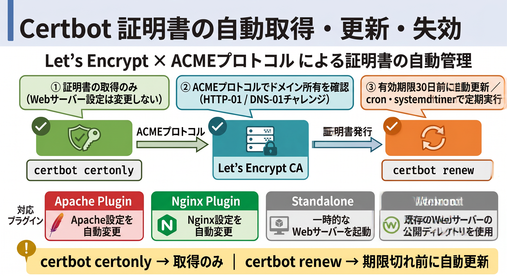

https://certbot.eff.org/

## Let's Encrypt
無料でSSL/TLS証明書を発行する非営利の認証局（CA）。2016年から運用開始され、ACMEプロトコルを使った自動化により、誰でも簡単にHTTPS化が可能になった。証明書の有効期限は90日で、自動更新を前提とした設計になっている。

## DNS-01チャレンジ
ドメインの所有権を証明するための認証方式の一つ。DNSのTXTレコードに特定の値を設定することで認証を行う。HTTP-01チャレンジと異なり、Webサーバーが不要で、ワイルドカード証明書（*.example.com）の取得が可能なのが特徴。Route53などのDNSサービスと連携して自動化できる。

※Felo AIにより生成
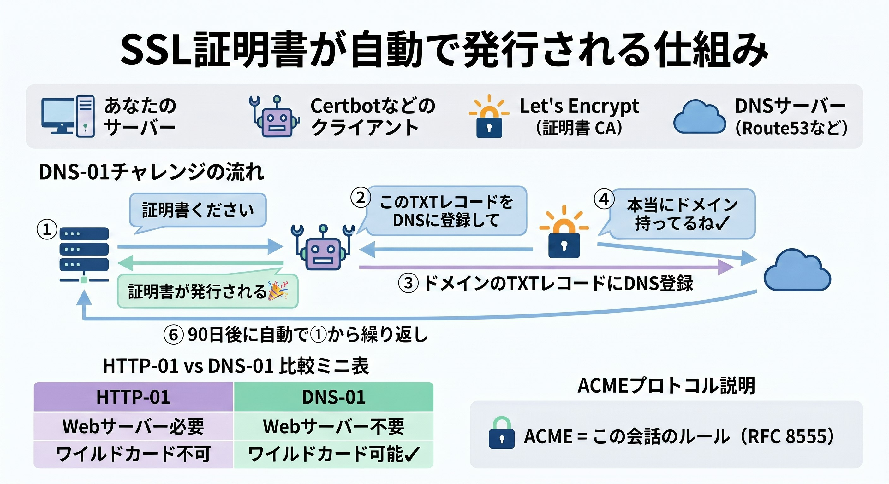

## サーバ証明書（SSL/TLS証明書）
Webサイトが正規のものであることを証明し、通信を暗号化するためのデジタル証明書。
HTTPSでの通信に必須。Let's Encryptでは90日間有効な証明書が無料で発行される。

### 証明書の有効期限短縮化（確定スケジュール）

CA/Browser Forumにより、証明書の有効期限は段階的に短縮されることが**正式に決定**されています：

| 日付 | 最大有効期間 | DCV再利用期間 |
|------|------------|--------------|
| 2026年3月14日まで | 398日 | 398日 |
| 2026年3月15日以降 | **200日** | 200日 |
| 2027年3月15日以降 | **100日** | 100日 |
| 2029年3月15日以降 | **47日** | 10日 |

※ DCV (Domain Control Validation) = ドメイン所有確認

#### なぜ短縮化されるのか？

1. **セキュリティ向上**
   - 秘密鍵が漏洩した場合の影響期間を最小化
   - 暗号化アルゴリズムの脆弱性への対応を迅速化

2. **自動化の促進**
   - 手動更新の負担を増やすことで、自動化への移行を促進
   - 人的ミスによる証明書期限切れを防止

3. **証明書管理の改善**
   - 古い証明書の放置を防止
   - より頻繁な検証により、不正な証明書発行を早期発見

**2029年以降は47日ごとに更新が必要**になるため、今のうちから自動更新の仕組みを構築しておくことが非常に重要になっている。

https://www.cybertrust.co.jp/blog/ssl/validity-period-shortening.html

※Felo AIにより生成
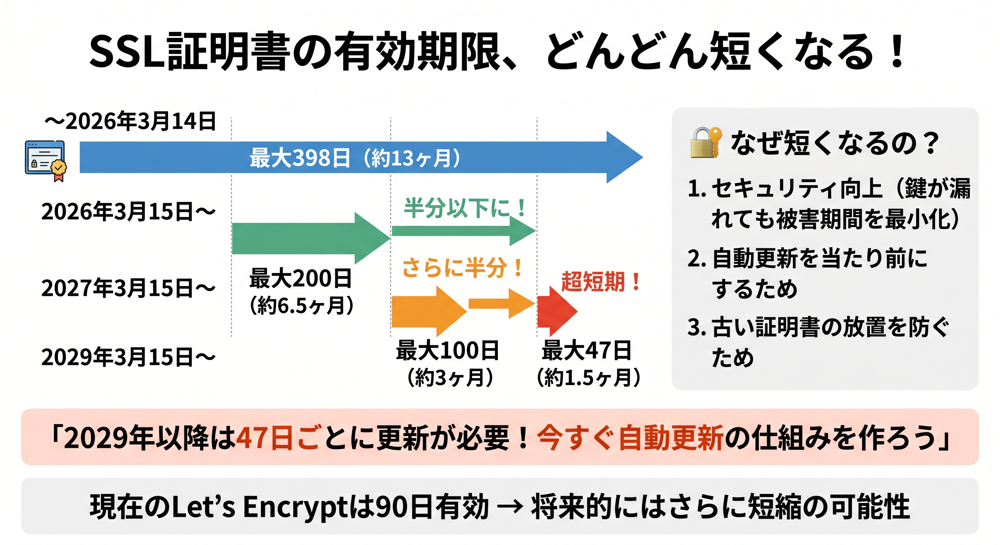

# 今回の環境イメージ

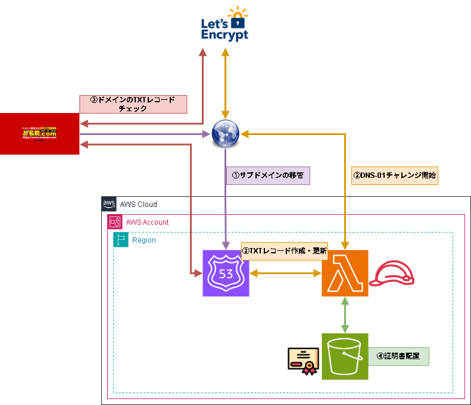

# 手順　
## 独自ドメインを購入する
お名前.comやIIJ、Route53等のドメインレジストラから独自ドメインを購入します。
トップレベルドメイン等の種類やドメインの人気度・価値によって値段が変わっていくので、各自確認ください。
この記事ではohtsuka-aws.xyzというドメインを使用したいと思います。

## Route53にサブドメイン用のパブリックホストゾーンを作成する
Route53の管理画面にアクセスして、ホストゾーンの作成を押下します。

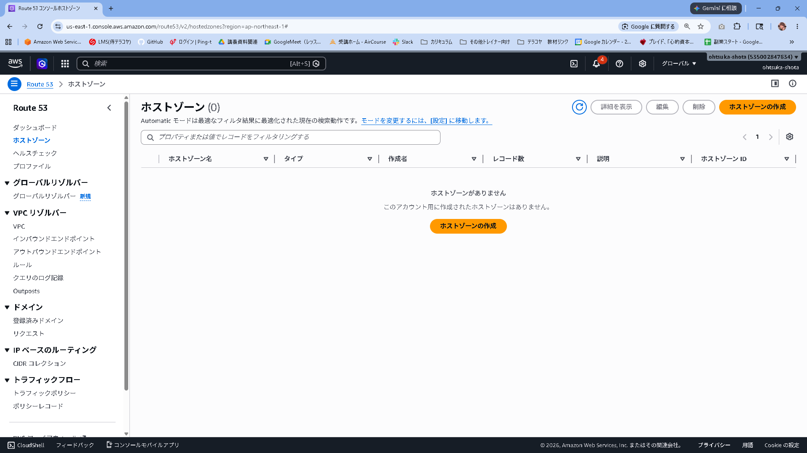

今回はdev.ohtsuka-aws.xyzというサブドメインをRoute53で管理したいと思います。
ドメイン名にに入力し、パブリックホストゾーンを選択して作成を押下します。
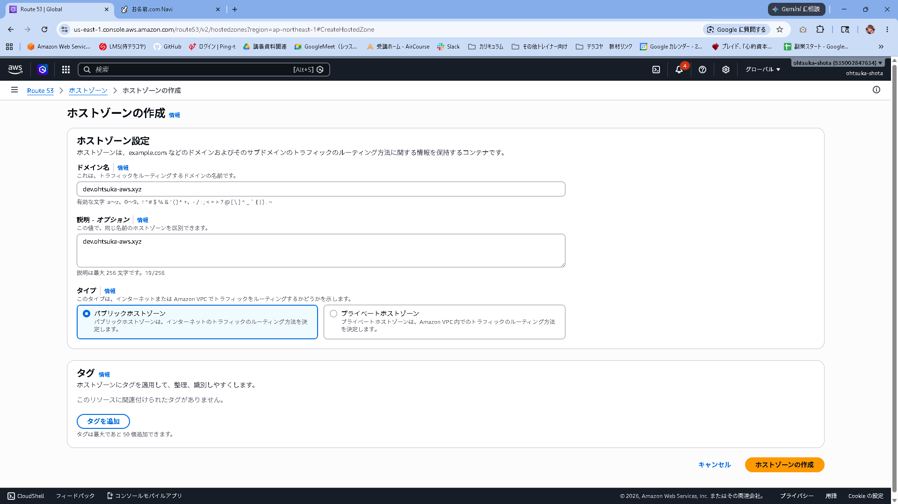

ホストゾーンが作成出来ました。
レコードが2件生成されていますが、この中のNSレコードの4つの値を使用します。
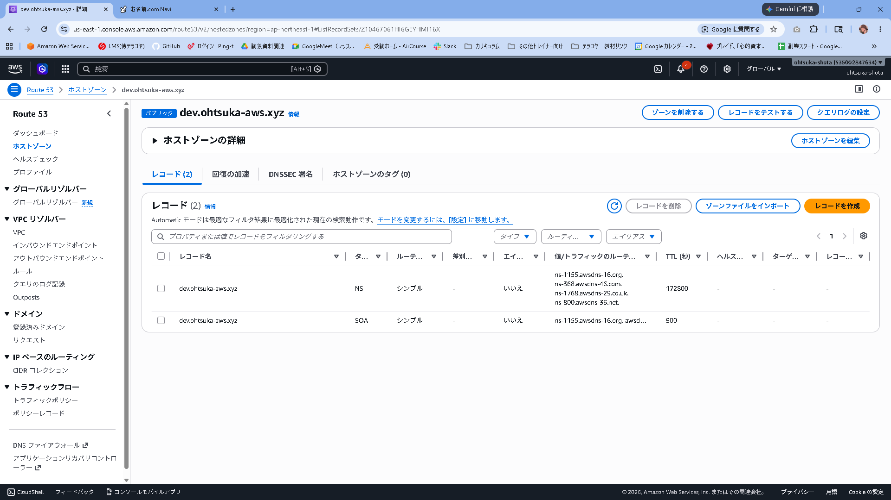

## ドメインレジストラにNSレコードを登録する
Route53で表示されていたNSレコードの4つの値を登録してください。
このようにすることでサブドメインのレコード管理をRoute53に移管することが出来ます。
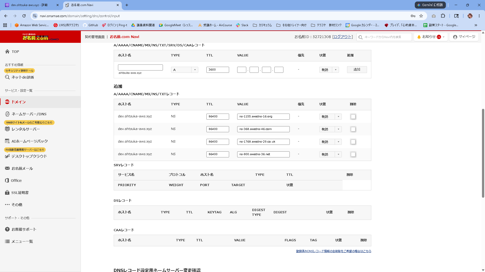

## IAMロールの準備
今回はLambdaを使用して、証明書の取得を行います。
DNS-01方式ではDNSのTXTレコードを操作する必要があります。そのためLambdaにRoute53への権限を与える必要があります。また、Lambdaで取得した証明書はS3へ保管しますのでS3への権限を与える必要があります。CloudWatchLogsにLambdaのログを吐き出させるための権限も与えましょう。

AWSのサービスを選択し、ユースケースはLambdaを選択します。
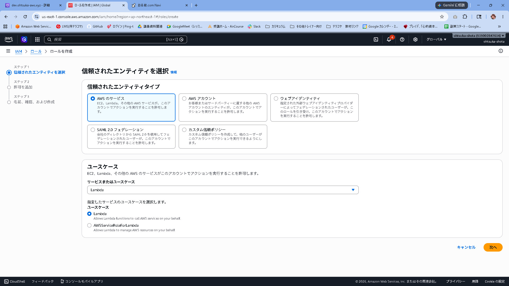

IAMポリシはS3FullAccessとRoute53FullAccess、CloudWatchLogsFullAccessをアタッチします。
Roleの名前はacme-lambda-roleとします。
※検証環境用なので、これで大丈夫ですが実環境では最小権限にするようにしましょう。
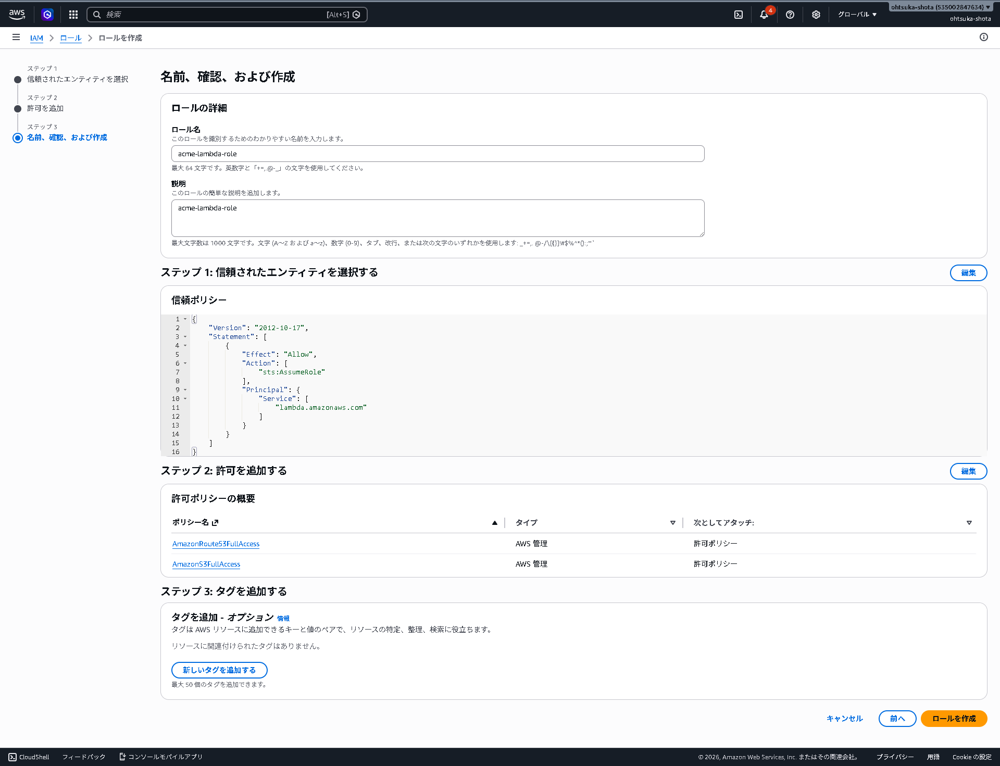

作成出来ました。
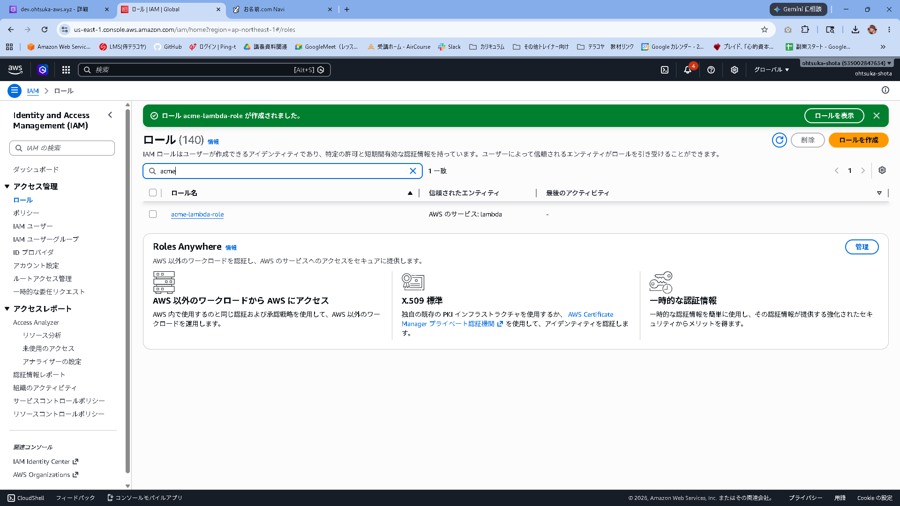

## S3作成
証明書格納用のS3バケットの名前をacme-s3-dev-ohtsuka-aws-xyzとして作成します。
作成時、S3の名前以外は弄ってません。
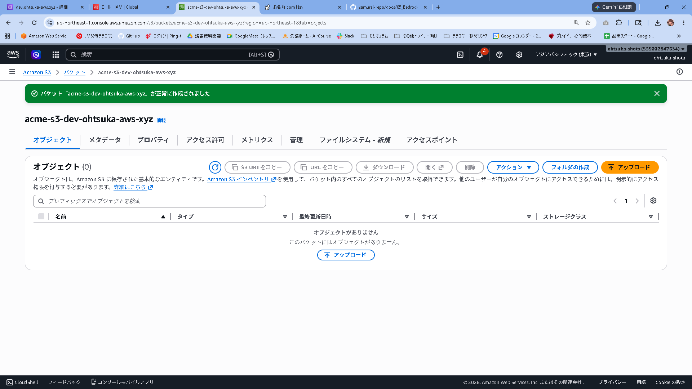

## Lambda作成
### デプロイ
acme-lambda-dev-ohtsuka-aws-xyzという名前で作成します。ランタイムはPython3.13とします。
カスタム実行ロールには先ほど作成したRoleを指定します。
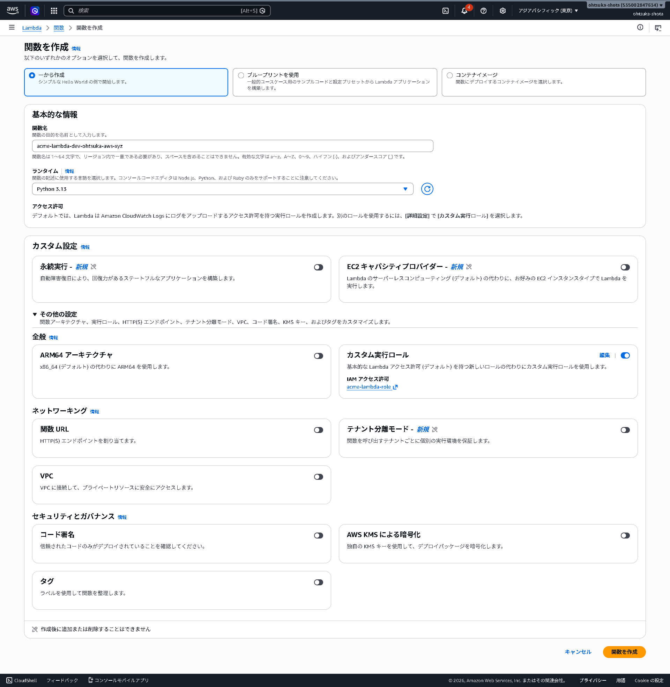

作成出来ました。
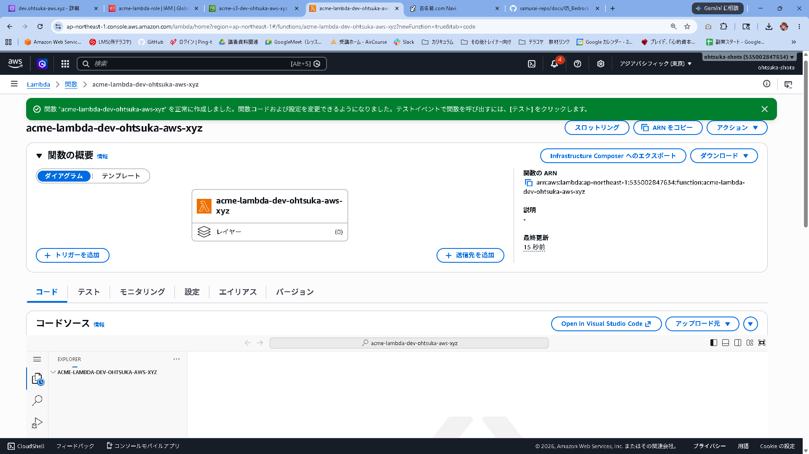

### Lambdaのコード
コードの中身を以下とします。
```python
import os
import boto3
import subprocess
import datetime
from cryptography import x509
from cryptography.hazmat.backends import default_backend

# --- 設定エリア ---
# 環境変数が設定されていない場合はエラーを出して停止させる
S3_BUCKET_NAME = os.environ.get('S3_BUCKET_NAME')
if not S3_BUCKET_NAME:
    raise ValueError("環境変数 'S3_BUCKET_NAME' が設定されていません。")

LE_EMAIL = os.environ.get('LE_EMAIL')
if not LE_EMAIL:
    raise ValueError("環境変数 'LE_EMAIL' が設定されていません。")

DOMAINS = os.environ.get('DOMAINS')
if not DOMAINS:
    raise ValueError("環境変数 'DOMAINS' が設定されていません。")

IS_DRY_RUN = os.environ.get('DRY_RUN', 'false').lower() == 'true'

s3_client = boto3.client('s3')

def needs_renewal():
    """
    S3から既存の証明書を取得し、有効期限が30日以内かチェックする。
    証明書が存在しない、またはエラーの場合は更新が必要とみなす。
    """
    domain = DOMAINS.split(',')[0].strip()
    s3_key = f"certificates/{domain}/cert.pem"
    
    try:
        response = s3_client.get_object(Bucket=S3_BUCKET_NAME, Key=s3_key)
        cert_data = response['Body'].read()
        cert = x509.load_pem_x509_certificate(cert_data, default_backend())
        
        # 有効期限の取得
        not_after = cert.not_valid_after
        remaining_days = (not_after - datetime.datetime.utcnow()).days
        
        print(f"証明書の有効期限: {not_after} (残り {remaining_days} 日)")
        
        # 残り30日以下なら更新が必要
        return remaining_days <= 30
        
    except s3_client.exceptions.NoSuchKey:
        print("既存の証明書がS3にありません（新規取得します）。")
        return True
    except Exception as e:
        print(f"既存の証明書がS3にないか、解析に失敗しました（新規取得します）: {e}")
        return True

def run_certbot():
    """
    Certbotコマンドを実行して証明書を取得・更新する。
    """
    print("Certbot を実行します...")
    
    # Lambdaの/tmpディレクトリを作業領域として使用
    config_dir = "/tmp/certbot/config"
    work_dir = "/tmp/certbot/work"
    logs_dir = "/tmp/certbot/logs"
    
    os.makedirs(config_dir, exist_ok=True)
    os.makedirs(work_dir, exist_ok=True)
    os.makedirs(logs_dir, exist_ok=True)
    
    # Certbotのコマンドライン引数を組み立て
    certbot_args = [
        "/opt/python/bin/certbot", "certonly",
        "--dns-route53",
        "--email", LE_EMAIL,
        "--domains", DOMAINS,
        "--agree-tos",
        "--non-interactive",
        "--config-dir", config_dir,
        "--work-dir", work_dir,
        "--logs-dir", logs_dir,
    ]
    
    if IS_DRY_RUN:
        certbot_args.append("--dry-run")
        
    # 環境変数の設定（Lambdaレイヤー内のPythonモジュールを認識させるため）
    env = os.environ.copy()
    env['PYTHONPATH'] = f"/opt/python:{env.get('PYTHONPATH', '')}"
    env['PATH'] = f"/opt/python/bin:{env.get('PATH', '')}"
    
    try:
        result = subprocess.run(
            certbot_args,
            env=env,
            capture_output=True,
            text=True,
            check=True
        )
        print("Certbot 標準出力:\n", result.stdout)
    except subprocess.CalledProcessError as e:
        print("Certbot 実行エラー!")
        print("標準出力:\n", e.stdout)
        print("標準エラー出力:\n", e.stderr)
        raise e

def upload_certificates():
    """
    Certbotが生成した証明書ファイルをS3にアップロードする。
    """
    domain = DOMAINS.split(',')[0].strip()
    live_dir = f"/tmp/certbot/config/live/{domain}"
    
    files_to_upload = ['cert.pem', 'privkey.pem', 'chain.pem', 'fullchain.pem']
    
    for filename in files_to_upload:
        local_path = os.path.join(live_dir, filename)
        s3_key = f"certificates/{domain}/{filename}"
        
        if os.path.exists(local_path):
            print(f"Uploading {filename} to s3://{S3_BUCKET_NAME}/{s3_key}")
            s3_client.upload_file(local_path, S3_BUCKET_NAME, s3_key)
        else:
            print(f"Warning: {local_path} が見つかりません。")

def lambda_handler(event, context):
    print(f"対象ドメイン: {DOMAINS}")
    print(f"Dry Run モード: {IS_DRY_RUN}")
    
    # 1. 更新が必要かチェック
    # Dry Runモードの時は、有効期限に関わらず強制的にCertbotのテストを実行する
    if not IS_DRY_RUN and not needs_renewal():
        print("証明書はまだ有効です。更新をスキップします。")
        return {"statusCode": 200, "body": "Renewal not needed"}
    elif IS_DRY_RUN:
        print("Dry Runモードのため、有効期限に関わらずCertbotのテスト実行を行います。")
        
    # 2. Certbotの実行
    run_certbot()
    
    # 3. 取得した証明書をS3へアップロード (Dry Run時はファイルが生成されないためスキップ)
    if not IS_DRY_RUN:
        upload_certificates()
        print("証明書の更新とS3へのアップロードが完了しました。")
    else:
        print("Dry Runモードのため、S3へのアップロードはスキップしました。")
        
    return {
        "statusCode": 200,
        "body": "Certificate renewal process completed successfully."
    }
```

### Lambdaコード用の環境変数
この関数は環境変数を使いますので、その設定を行います。
設定タブの環境変数を押下します。
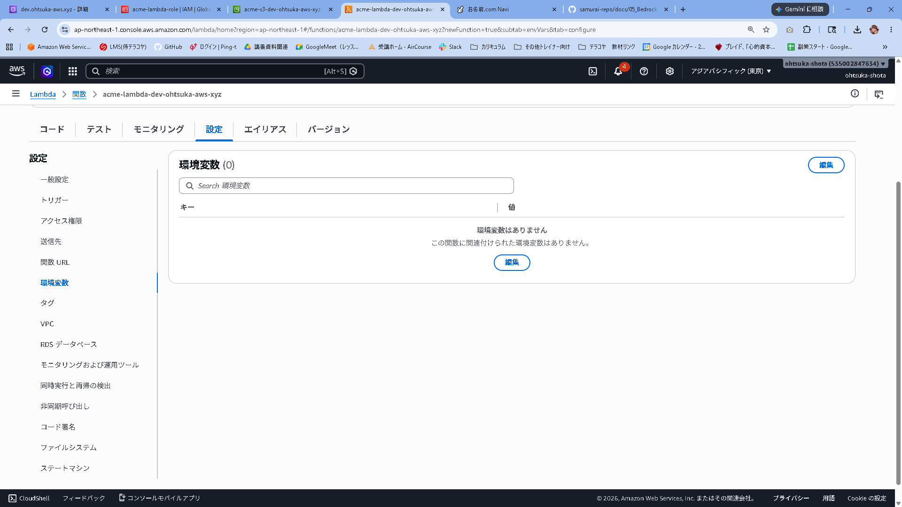

DOMAINS,S3_BUCKET_NAME,LE_EMAIL,DRY_RUNの設定を行います。
それぞれの値に余計なスペースが入っていないことを確認してください（1敗）
LE_EMAILには自身のメールアドレスを入力ください。
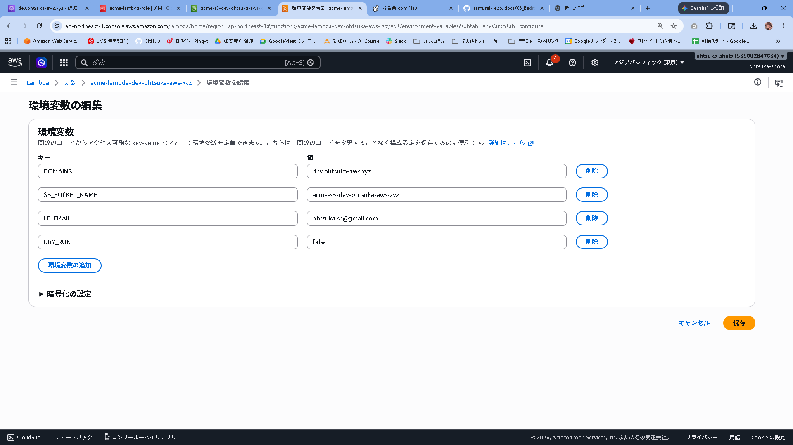

### Lambdaのメモリとタイムアウト値の調整
また、一般設定においてメモリを256MBにして、タイムアウトを10分に設定します。
デフォルト値だと処理が間に合いません。
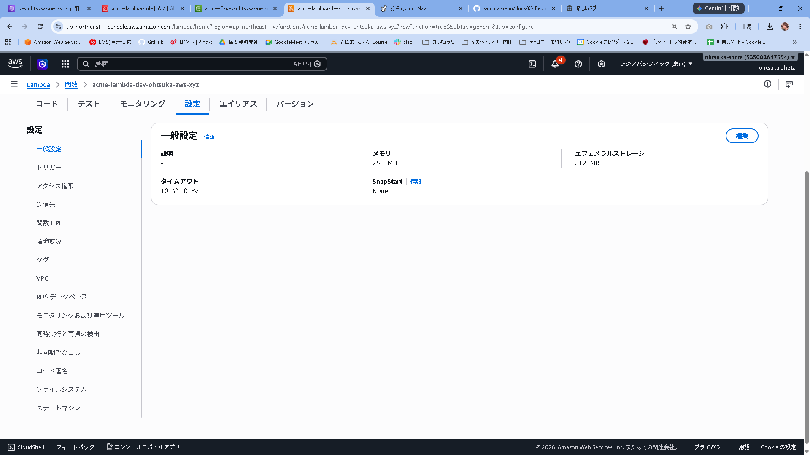

### Lambdaレイヤの作成
このLambdaはCertbot等の外部ライブラリを使用します。
そのためレイヤを作成して、それをLambdaに紐づける必要があります。そのレイヤを作成するための資材を作成します。
Dockerを動かせる環境を用意します。この記事ではホームラボのUbuntu24.04環境を使用します。
Dockerが動いていることを確認したらpythonというフォルダを作成します。このフォルダ名は必ずpythonにします。
```
test@ubuntu-cui:~$ sudo su -
[sudo] password for test:
root@ubuntu-cui:~# systemctl status docker
● docker.service - Docker Application Container Engine
     Loaded: loaded (/usr/lib/systemd/system/docker.service; enabled; preset: e>
     Active: active (running) since Tue 2026-05-19 12:03:07 UTC; 3 days ago
TriggeredBy: ● docker.socket
root@ubuntu-cui:~# mkdir -p python
root@ubuntu-cui:~# ls
genai-ai-api  genai-web  ndlocr-lite-app  python
```

public.ecr.aws/lambda/python:3.13というコンテナイメージを使ってレイヤの資材を準備します。
これはAWSが用意しているLambdaを模倣するようなコンテナイメージになります。
コンテナ内には入れたら、pipコマンドでcertbot,certbot-dns-route53,cryptographyライブラリをインストールします。それぞれのライブラリの意味は以下です。

| ライブラリ | 説明 |
|---|---|
| certbot | SSL/TLS証明書を自動取得・更新するツール |
| certbot-dns-route53 | Route53を使ったDNS認証用のCertbotプラグイン |
| cryptography | 暗号化処理を行うPythonライブラリ |

```
root@ubuntu-cui:~# docker run --rm -it -v "$PWD":/var/task --entrypoint /bin/bash public.ecr.aws/lambda/python:3.13
Unable to find image 'public.ecr.aws/lambda/python:3.13' locally
3.13: Pulling from lambda/python
ced28d7376b1: Pull complete
cabee8b913b6: Pull complete
64eed166f1f3: Pull complete
18919a7d675d: Pull complete
dda1d2d82b43: Pull complete
43cdd0cd53bd: Pull complete
Digest: sha256:55be4d8261ca560bbd114fa54df20fa68421c56956a485ae30f31a7c2651887d
Status: Downloaded newer image for public.ecr.aws/lambda/python:3.13
bash-5.2#

# 指定したディレクトリ（/var/task/python）にライブラリをインストール
bash-5.2# pip install certbot certbot-dns-route53 cryptography -t python/
bash-5.2# exit
exit
root@ubuntu-cui:~# ls python/
81d243bd2c585b0f4821__mypyc.cpython-313-x86_64-linux-gnu.so  charset_normalizer-3.4.7.dist-info  parsedatetime-2.6.dist-info
acme                                                         configargparse-1.7.5.dist-info      __pycache__
acme-5.6.0.dist-info                                         configargparse.py                   pycparser
bin                                                          configobj                           pycparser-3.0.dist-info
boto3                                                        configobj-5.0.9.dist-info           pyopenssl-26.2.0.dist-info
boto3-1.43.14.dist-info                                      cryptography                        pyrfc3339
botocore                                                     cryptography-48.0.0.dist-info       pyrfc3339-2.1.0.dist-info
botocore-1.43.14.dist-info                                   dateutil                            python_dateutil-2.9.0.post0.dist-info
certbot                                                      distro                              requests
certbot-5.6.0.dist-info                                      distro-1.9.0.dist-info              requests-2.34.2.dist-info
certbot_dns_route53                                          idna                                s3transfer
certbot_dns_route53-5.6.0.dist-info                          idna-3.16.dist-info                 s3transfer-0.17.0.dist-info
certifi                                                      jmespath                            six-1.17.0.dist-info
certifi-2026.5.20.dist-info                                  jmespath-1.1.0.dist-info            six.py
cffi                                                         josepy                              urllib3
cffi-2.0.0.dist-info                                         josepy-2.2.0.dist-info              urllib3-2.7.0.dist-info
_cffi_backend.cpython-313-x86_64-linux-gnu.so                OpenSSL                             validate
charset_normalizer                                           parsedatetime
```

このpyhonフォルダ配下をzip化して持ち出します。
```
root@ubuntu-cui:~# apt install -y zip
root@ubuntu-cui:~# ls
certbot-layer.zip  genai-ai-api  genai-web  ndlocr-lite-app  python
root@ubuntu-cui:~# zip -r certbot-layer.zip python/
root@ubuntu-cui:~# cp -p certbot-layer.zip /tmp/
```

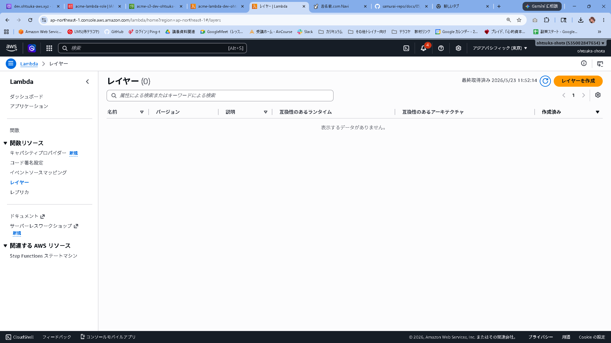

レイヤ名はcertbot-layerとし、.zipファイルをアップロード。
互換性は指定しなくても大丈夫ですが、指定しておきます。
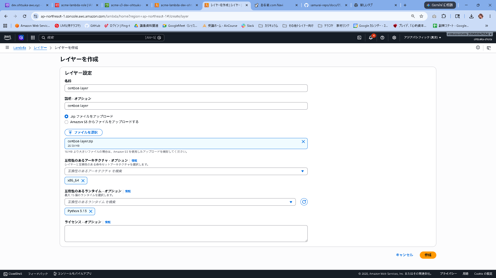

作成出来ました。このARNを控えます。
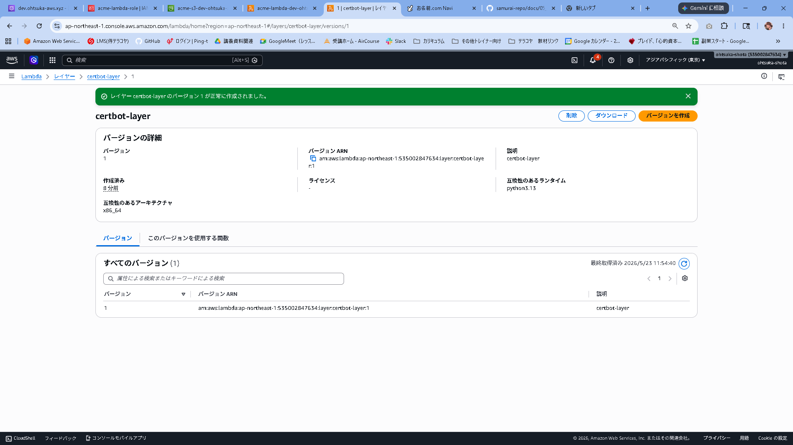

### レイヤの紐づけ
以下の設定を行い、レイヤを検証の上紐づけていきます。
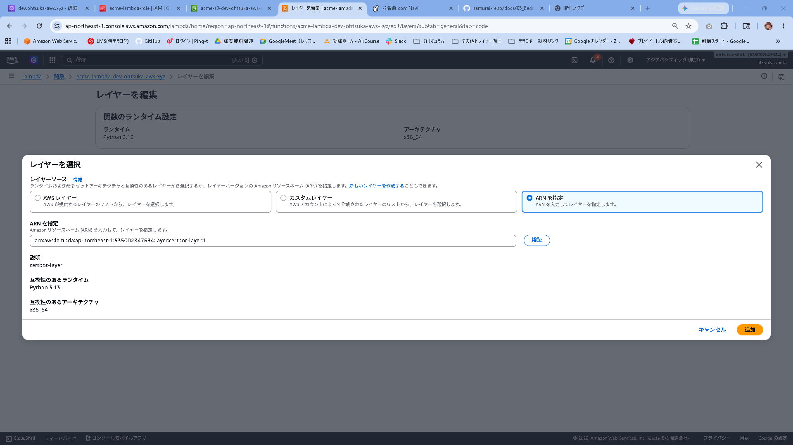

以下のように、コード・レイヤが設定されていれば大丈夫です。
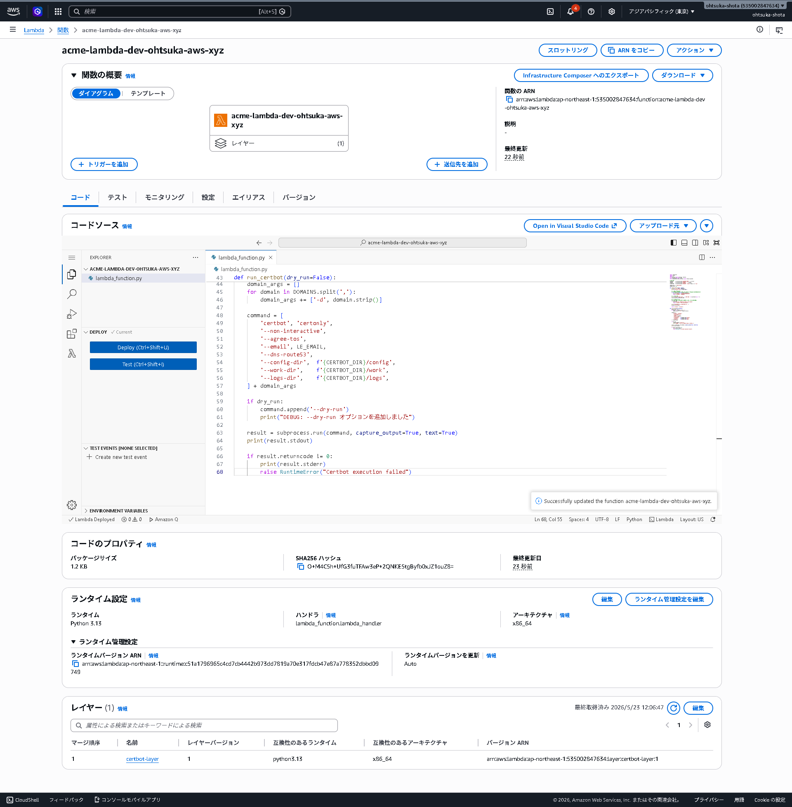

# 動作確認
## 証明書取得1回目
実際に試してみます。Testボタンを押下して動作確認を行います。
StatusがSucceededとなっていれば大丈夫です。
```
Status: Succeeded
Test Event Name: test

Response:
{
  "statusCode": 200,
  "body": "Certificates updated and uploaded to S3"
}

The area below shows the last 4 KB of the execution log.

Function Logs:
START RequestId: 0f8e2db4-a7e0-4877-a327-a5c4a74904da Version: $LATEST
対象ドメイン: dev.ohtsuka-aws.xyz
Dry Run モード: False
既存の証明書がS3にないか、解析に失敗しました（新規取得します）: An error occurred (NoSuchKey) when calling the GetObject operation: The specified key does not exist.
Certbot を実行します...
Certbot 標準出力:
Account registered.
Requesting a certificate for dev.ohtsuka-aws.xyz
Successfully received certificate.
Certificate is saved at: /tmp/certbot/config/live/dev.ohtsuka-aws.xyz/fullchain.pem
Key is saved at:         /tmp/certbot/config/live/dev.ohtsuka-aws.xyz/privkey.pem
This certificate expires on 2026-08-21.
These files will be updated when the certificate renews.
NEXT STEPS:
- The certificate will need to be renewed before it expires. Certbot can automatically renew the certificate in the background, but you may need to take steps to enable that functionality. See https://certbot.org/renewal-setup for instructions.
- - - - - - - - - - - - - - - - - - - - - - - - - - - - - - - - - - - - - - - -
If you like Certbot, please consider supporting our work by:
* Donating to ISRG / Let's Encrypt:   https://letsencrypt.org/donate
* Donating to EFF:                    https://eff.org/donate-le
- - - - - - - - - - - - - - - - - - - - - - - - - - - - - - - - - - - - - - - -
Uploading cert.pem to s3://acme-s3-dev-ohtsuka-aws-xyz/certificates/dev.ohtsuka-aws.xyz/cert.pem
Uploading privkey.pem to s3://acme-s3-dev-ohtsuka-aws-xyz/certificates/dev.ohtsuka-aws.xyz/privkey.pem
Uploading chain.pem to s3://acme-s3-dev-ohtsuka-aws-xyz/certificates/dev.ohtsuka-aws.xyz/chain.pem
Uploading fullchain.pem to s3://acme-s3-dev-ohtsuka-aws-xyz/certificates/dev.ohtsuka-aws.xyz/fullchain.pem
END RequestId: 0f8e2db4-a7e0-4877-a327-a5c4a74904da
REPORT RequestId: 0f8e2db4-a7e0-4877-a327-a5c4a74904da	Duration: 38020.68 ms	Billed Duration: 38703 ms	Memory Size: 256 MB	Max Memory Used: 157 MB	Init Duration: 681.96 ms

Request ID: 0f8e2db4-a7e0-4877-a327-a5c4a74904da
```
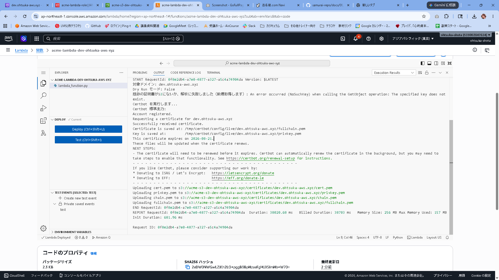

S3バケットに証明書があることを確認します。
取得できてますね。
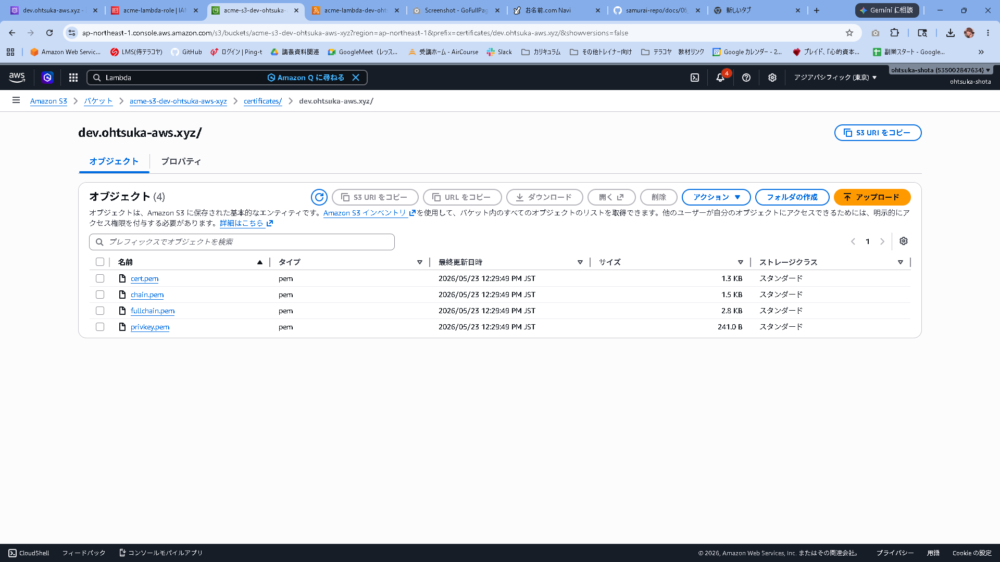

## 証明書取得（有効期限的に大丈夫だった場合）
証明書の有効期限がある場合、このように処理をスキップします。
EventBridgeで2回/日という感じで実行間隔を設定しておくことで、証明書の自動取得が出来ると思います。
```
Status: Succeeded
Test Event Name: test

Response:
{
  "statusCode": 200,
  "body": "Renewal not needed"
}

The area below shows the last 4 KB of the execution log.

Function Logs:
START RequestId: 1d67074c-d457-4fc0-8454-1ebb03a32224 Version: $LATEST
対象ドメイン: dev.ohtsuka-aws.xyz
Dry Run モード: False
証明書の残り有効期間: 89 日
証明書はまだ有効です。更新をスキップします。
END RequestId: 1d67074c-d457-4fc0-8454-1ebb03a32224
REPORT RequestId: 1d67074c-d457-4fc0-8454-1ebb03a32224	Duration: 358.36 ms	Billed Duration: 1056 ms	Memory Size: 256 MB	Max Memory Used: 101 MB	Init Duration: 697.04 ms

Request ID: 1d67074c-d457-4fc0-8454-1ebb03a32224
```
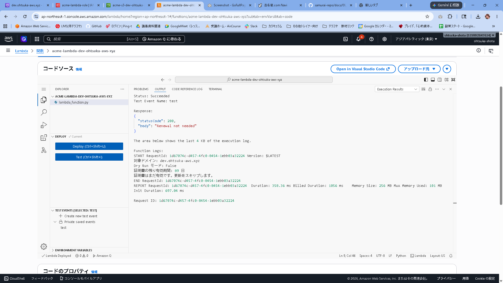

**EventBridge Scheduler の設定例（今後実装記事を上げるかも？）**
名前: acme-certificate-renewal
スケジュール式: cron(0 2,14 * * ? *)  # 毎日2時と14時(UTC)
ターゲット: Lambda関数 (acme-lambda-dev-ohtsuka-aws-xyz)
入力: {}
タイムゾーン: UTC


## Dry-Run
環境変数のDRY_RUNをtrueにします。
その後Lambdaを実行すると以下のように出力されます。
```
Status: Succeeded
Test Event Name: test

Response:
{
  "statusCode": 200,
  "body": "Certificate renewal process completed successfully."
}

The area below shows the last 4 KB of the execution log.

Function Logs:
START RequestId: f3dad80a-8299-4b40-9200-131b39c0d630 Version: $LATEST
対象ドメイン: dev.ohtsuka-aws.xyz
Dry Run モード: True
Dry Runモードのため、有効期限に関わらずCertbotのテスト実行を行います。
Certbot を実行します...
Certbot 標準出力:
Account registered.
Simulating a certificate request for dev.ohtsuka-aws.xyz
The dry run was successful.
Dry Runモードのため、S3へのアップロードはスキップしました。
END RequestId: f3dad80a-8299-4b40-9200-131b39c0d630
REPORT RequestId: f3dad80a-8299-4b40-9200-131b39c0d630	Duration: 35716.71 ms	Billed Duration: 36415 ms	Memory Size: 256 MB	Max Memory Used: 157 MB	Init Duration: 697.41 ms

Request ID: f3dad80a-8299-4b40-9200-131b39c0d630
```
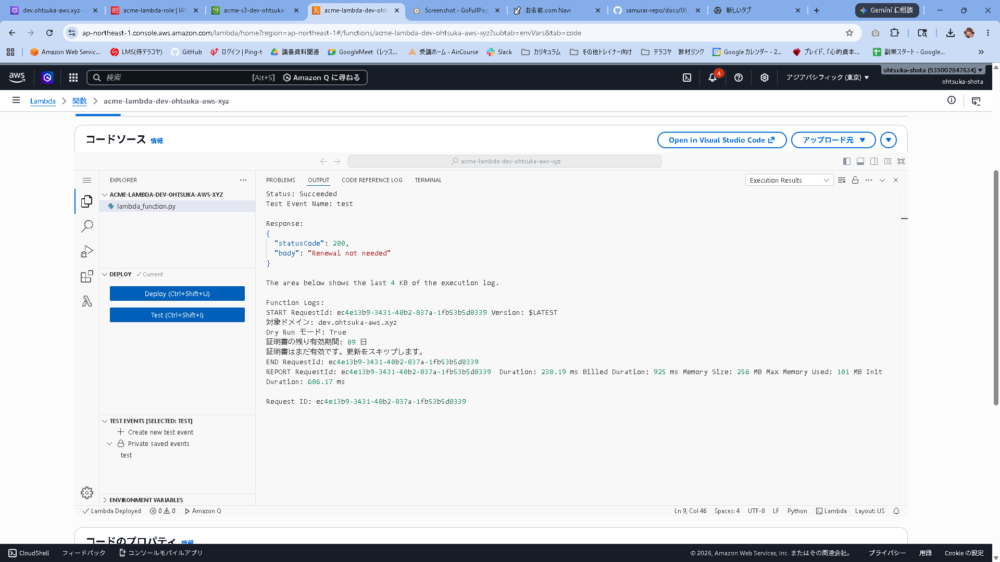

# 続き
## EC2のApache/Nginxに証明書を自動適用する

[[ssl-cert-auto-apply-ec2]]

# HTTP-01チャレンジ

[[ssl-cert-short-lifetime-acme-http01]]

## チャレンジ方式の比較

| 項目 | DNS-01 | HTTP-01 |
|------|--------|---------|
| 所有権の証明方法 | DNSのTXTレコードにトークンを登録 | `/.well-known/acme-challenge/` にトークンを公開 |
| ポート80の開放 | 不要 | 必要 |
| ワイルドカード証明書 | 対応（`*.example.com`） | 非対応 |
| DNSプロバイダーのAPI連携 | 必要 | 不要 |
| 自動化の難易度 | DNSプロバイダー次第 | 比較的容易 |
| セキュリティリスク | DNSのAPI認証情報の管理が必要 | 証明書取得時にポート80を外部公開する必要がある |
| サーバーへの直接アクセス | 不要（サーバーが非公開でも可） | 必要（外部からHTTPアクセスできる必要がある） |
| 対応ドメイン数 | 複数・ワイルドカード含め柔軟 | 1ドメインずつ個別に対応 |
| DNS伝播待ちの影響 | あり（TTLによっては数分〜数十分） | 基本的になし（※新規ドメイン設定直後を除く） |
| 他サーバの代理取得（証明書の集中管理） | 容易（対象サーバに依存せず、別サーバで取得可能） | 困難（対象ドメインの80番ポート宛の通信をプロキシ等で転送する設定が必要） |


