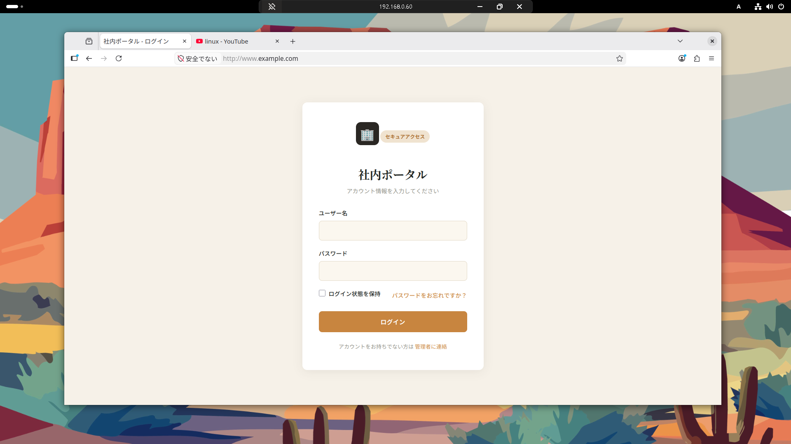
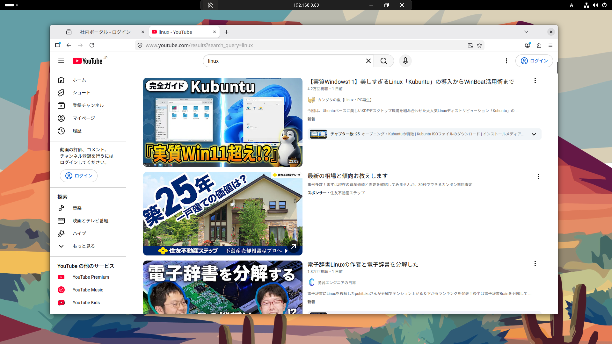
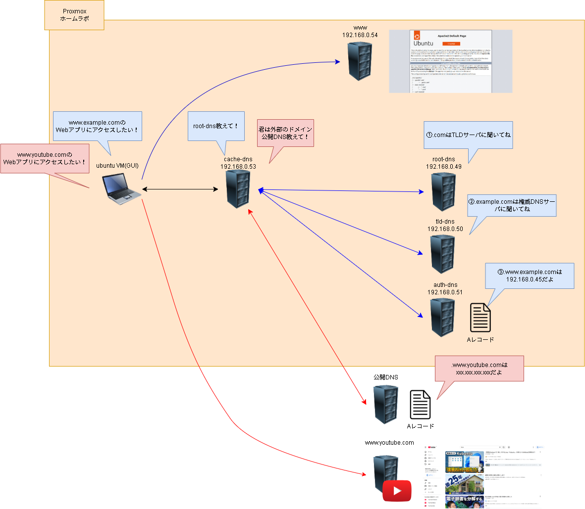

諸般の理由でProxmox上に用意しているホームラボに名前解決環境を用意したかったので、メモっておきます。
なお、2年くらい前にDNSについては軽く書いてますが、今回の方がかなり複雑であると思います。

[[ubuntu-dns-server]]

# 用語
## スタブリゾルバ

- **役割**: 情報を求める「クライアント」。
    - ユーザーがブラウザにドメイン名（例: [www.example.com](http://www.example.com/)）を入力すると、スタブリゾルバーがそのドメイン名に対応するIPアドレスを探し始めます。
    - 主にPCやスマートフォン、アプリケーションなどが該当します。

## フルリゾルバ

**別名**: キャッシュDNSサーバー、参照サーバー。
**役割**: 情報を探し出す「仲介者」。

  - スタブリゾルバーからのリクエストを受け取り、必要な情報を探しに行きます。
  - ルートDNSサーバーや権威DNSサーバーに問い合わせを行い、最終的にIPアドレスを取得します。
  - 取得した情報をキャッシュとして保存し、次回以降の問い合わせを効率化します。

## 権威DNSサーバー

**役割**: 情報を提供する「データの保有者」。

  - ドメイン名とIPアドレスの対応表（ゾーンファイル）を管理し、フルリゾルバーからの問い合わせに対して正確な情報を返します。
  - 例えば、「www.example.com」や「mail.example.com」のIPアドレスを管理しているサーバーが該当します。
  - ルートDNSサーバーやトップレベルドメイン（TLD）サーバーから委任された情報を基に動作します。

## トップレベルドメイン（TLD）サーバー

**役割**
  - ルートDNSサーバーから紹介された後、特定のTLD（例: `.com`、`.jp`）に属するドメインの権威DNSサーバーの情報を管理。
  - 具体的なドメイン名（例: `example.com`）の権威DNSサーバーを案内する。

## ルートDNSサーバー

**役割**
  - DNS階層の最上位に位置し、名前解決の起点となるサーバー。
  - ドメイン名の最右端（例: `.com`、`.jp`）に対応するトップレベルドメイン（TLD）サーバーの情報を管理。
  - 自身では具体的なドメイン名とIPアドレスの対応情報を持たず、次に問い合わせるべきTLDサーバーを案内する。
  - 世界中に13のルートDNSサーバーのネットワークが存在し、エニーキャスト技術を用いて冗長性と信頼性を確保している

## 各種役割のイメージ


## BIND
「Berkeley Internet Name Domain」の略で、DNSサーバを構築するための代表的なオープンソースソフトウェアです。

https://www.isc.org/bind/

以下BINDで使う設定ファイルの一部についてです。
### named.conf
BINDのメイン設定ファイルで、全体の動作設定を管理します。他の設定ファイルをインクルードする役割も持ちます。
### named.conf.local
独自のゾーン設定を記述するファイルです。ユーザーが追加するゾーン情報を管理します。
### named.conf.options
BIND全体の動作オプションを設定するファイルで、例えばキャッシュや転送設定などを記述します。
### named.conf.default-zones
デフォルトのゾーン（ルートゾーンやローカルゾーン）に関する設定を記述するファイルです。
### db.●●
ゾーンファイルの一種で、ドメイン名とIPアドレスの対応を記述します。正引きや逆引きの情報を管理します。
### db.root.hint
ルートネームサーバの情報を記述したファイルで、DNSの名前解決の起点となります。


# 構築環境イメージ
自宅にあるProxmoxの仮想化環境（ホームラボ）にルートDNSサーバ、TLDサーバ、権威DNSサーバ、フルリゾルバサーバ（キャッシュDNSサーバ）、スタブリゾルバ(GUI環境VM)、Webサーバを立ち上げてそれぞれ設定を入れていきます。
スタブリゾルバに「名前解決をするときは自作したフルリゾルバにクエリを投げるよう」に設定を入れます。クエリを受け取ったフルリゾルバはルートDNSにクエリを投げて、ルートDNSはクエリに沿ったTLDの情報を返答。その流れを数ラリー行い、最終的に権威DNSがクエリ内容に対応するIPアドレスをフルリゾルバに返答。フルリゾルバはスタブリゾルバにIPアドレスを返答し、最終的にそのIPアドレスを持つWebサーバにアクセスできるようにします。

併せてホームラボ上のスタブリゾルバとそれ以外のスタブリゾルバで同じドメインにアクセスしようとしているのに別のサーバに行くことも確認してみます。


# 構築
基本的にLXCを使ってDNSサーバ系を作ります。VMでも基本的には同じであると思います。

[[proxmox-ve-container-deploy]]

[[proxmox-ve-container-ssh]]

## ルートDNSサーバ構築
スペックは最小限


パッケージの最新化は行います。パッケージ最新化後はsnapshotを取っておいてロールバックできるようにしておきます。


以下のコマンドを実行してBINDをインストールします。
```
apt install -y bind9 bind9utils bind9-doc
```

/etc/bind/named.confにTLDサーバの情報が記載されているdb.rootのファイルパス追加します。
```
root@root-dns:~# cd /etc/bind
root@root-dns:/etc/bind# ls
bind.keys  db.127  db.empty  named.conf                named.conf.local    rndc.key
db.0       db.255  db.local  named.conf.default-zones  named.conf.options  zones.rfc1918
root@root-dns:/etc/bind# cp -p named.conf named.conf.origin
root@root-dns:/etc/bind# vi named.conf
root@root-dns:/etc/bind# cat named.conf
// This is the primary configuration file for the BIND DNS server named.
//
// Please read /usr/share/doc/bind9/README.Debian for information on the
// structure of BIND configuration files in Debian, *BEFORE* you customize
// this configuration file.
//
// If you are just adding zones, please do that in /etc/bind/named.conf.local

include "/etc/bind/named.conf.options";
include "/etc/bind/named.conf.local";
include "/etc/bind/named.conf.default-zones";

// add .com TLD Server
zone "." IN {
    type master;
    file "/etc/bind/db.root";
};
```

/etc/bind/db.rootを新規作成して中身を以下とします。
192.168.0.50は各自の環境に合わせてください。
.com系のドメインは指定のIPアドレスのサーバに聞いてねという事を記載してます。
```
root@root-dns:/etc/bind# vi db.root
root@root-dns:/etc/bind# cat db.root
$TTL 86400
@   IN  SOA     root-dns. admin.root. (
        2026040403
        3600
        1800
        604800
        86400 )

    IN  NS      root-dns.

; com delegation
com.    IN  NS  tld-dns.

; glue
root-dns.  IN  A   192.168.0.49
tld-dns.   IN  A   192.168.0.50
```

bindを再起動して、設定を読み込みこませます。
```
root@root-dns:/etc/bind# systemctl restart bind9
```

## TLDサーバ構築
スペックとパッケージ更新は先ほどと同様です。
以下のコマンドを実行してBINDをインストールします。
```
apt install -y bind9 bind9utils bind9-doc
```


/etc/bind/named.conf.localにTLDサーバの情報が記載されているdb.comのファイルパス追加します。
```
root@tld-dns:~# cd /etc/bind
root@tld-dns:/etc/bind# ls
bind.keys  db.127  db.empty  named.conf                named.conf.local    rndc.key
db.0       db.255  db.local  named.conf.default-zones  named.conf.options  zones.rfc1918
root@tld-dns:/etc/bind# cp -p named.conf.local named.conf.local.origin
root@tld-dns:/etc/bind# vi named.conf.local
root@tld-dns:/etc/bind# cat named.conf.local
//
// Do any local configuration here
//

// Consider adding the 1918 zones here, if they are not used in your
// organization
//include "/etc/bind/zones.rfc1918";

zone "com" IN {
    type master;
    file "/etc/bind/db.com";
};
```

TLDゾーンファイルの作成します。
/etc/bind/db.comを作成し、以下を記述します。
権威DNSのサーバ情報とTLDサーバの情報を記載してますが、環境に合わせてください。
```
$TTL 86400
@   IN  SOA     tld-dns. admin.com. (
        2026040403
        3600
        1800
        604800
        86400 )

    IN  NS      tld-dns.

; example.com delegation
example.com.    IN  NS  auth-dns.example.com.

; glue
tld-dns.                 IN  A   192.168.0.50
auth-dns.example.com.    IN  A   192.168.0.51
```

bindを再起動して、設定を読み込みこませます。
```
root@root-dns:/etc/bind# systemctl restart bind9
```

## 権威DNSサーバ構築
スペックとパッケージ更新は他と同様です。
以下のコマンドを実行してBINDをインストールします。
```
apt install -y bind9 bind9utils bind9-doc
```

named.conf.localにexample.comのAレコード等が記載されているdb.example.comのファイルパス追加します。
```
root@auth-dns:~# cd /etc/bind
root@auth-dns:/etc/bind# ls
bind.keys  db.127  db.empty  named.conf                named.conf.local    rndc.key
db.0       db.255  db.local  named.conf.default-zones  named.conf.options  zones.rfc1918
root@auth-dns:/etc/bind# cp -p named.conf.local named.conf.local.origin
root@auth-dns:/etc/bind# vi named.conf.local
root@auth-dns:/etc/bind# cat named.conf.local
//
// Do any local configuration here
//

// Consider adding the 1918 zones here, if they are not used in your
// organization
//include "/etc/bind/zones.rfc1918";

zone "example.com" IN {
    type master;
    file "/etc/bind/db.example.com";
};
```

権威ゾーンファイルの作成を行います。
※逆引きは一旦影響しないので作成しません。
```
root@auth-dns:/etc/bind# vi db.example.com
root@auth-dns:/etc/bind# cat db.example.com
$TTL 86400
@   IN  SOA     auth-dns.example.com. admin.example.com. (
        2026040403
        3600
        1800
        604800
        86400 )

    IN  NS      auth-dns.example.com.

auth-dns   IN  A   192.168.0.51
www        IN  A   192.168.0.54
```

設定確認と動作確認を行います。
まずは各種confファイルのチェックをnamed-checkconfコマンドで実行。
問題なさそうであればbindの再起動を行います。
```
root@auth-dns:/etc/bind# named-checkconf
root@auth-dns:/etc/bind# named-checkzone example.com /etc/bind/db.example.com
zone example.com/IN: loaded serial 2026040401
OK

root@auth-dns:/etc/bind# systemctl restart bind9
```

## 一旦動作確認
### 権威DNS
権威DNSが自身に対して名前解決のクエリを投げます。
"www.example.com.        86400   IN      A       192.168.0.54"と出ているので問題なさそうです。
```
root@auth-dns:/etc/bind# dig @127.0.0.1 www.example.com

; <<>> DiG 9.18.39-0ubuntu0.24.04.3-Ubuntu <<>> @127.0.0.1 www.example.com
; (1 server found)
;; global options: +cmd
;; Got answer:
;; ->>HEADER<<- opcode: QUERY, status: NOERROR, id: 27447
;; flags: qr aa rd ra; QUERY: 1, ANSWER: 1, AUTHORITY: 0, ADDITIONAL: 1

;; OPT PSEUDOSECTION:
; EDNS: version: 0, flags:; udp: 1232
; COOKIE: 4969797ef292b2e80100000069d0f6b91138065126792397 (good)
;; QUESTION SECTION:
;www.example.com.               IN      A

;; ANSWER SECTION:
www.example.com.        86400   IN      A       192.168.0.54

;; Query time: 0 msec
;; SERVER: 127.0.0.1#53(127.0.0.1) (UDP)
;; WHEN: Sat Apr 04 11:32:09 UTC 2026
;; MSG SIZE  rcvd: 88
```

### TLD DNS
こちらも自分自身に対してexample.comのクエリを投げます。
example.comについて確認したいときはauth-dns.example.com.local.に確認に行くようにと言う回答が来ているようなので、問題なさそうです。
```
root@tld-dns:/etc/bind# dig @192.168.0.51 example.com NS

; <<>> DiG 9.18.39-0ubuntu0.24.04.3-Ubuntu <<>> @192.168.0.51 example.com NS
; (1 server found)
;; global options: +cmd
;; Got answer:
;; ->>HEADER<<- opcode: QUERY, status: NOERROR, id: 58250
;; flags: qr aa rd ra; QUERY: 1, ANSWER: 1, AUTHORITY: 0, ADDITIONAL: 1

;; OPT PSEUDOSECTION:
; EDNS: version: 0, flags:; udp: 1232
; COOKIE: 73a2fd3eb62c84230100000069d0fd3ec4e07cc1a63b9b84 (good)
;; QUESTION SECTION:
;example.com.                   IN      NS

;; ANSWER SECTION:
example.com.            86400   IN      NS      auth-dns.example.com.local.

;; Query time: 0 msec
;; SERVER: 192.168.0.51#53(192.168.0.51) (UDP)
;; WHEN: Sat Apr 04 11:59:58 UTC 2026
;; MSG SIZE  rcvd: 108
```

### ルートDNS
こちらも自分自身に対してcomのクエリを投げます。
comについて確認したいときはtld-dns.に確認に行くようにと言う回答が来ているようなので、問題なさそうです。
```
root@root-dns:/etc/bind#  dig @192.168.0.50 com NS

; <<>> DiG 9.18.39-0ubuntu0.24.04.3-Ubuntu <<>> @192.168.0.50 com NS
; (1 server found)
;; global options: +cmd
;; Got answer:
;; ->>HEADER<<- opcode: QUERY, status: NOERROR, id: 13938
;; flags: qr aa rd ra; QUERY: 1, ANSWER: 1, AUTHORITY: 0, ADDITIONAL: 1

;; OPT PSEUDOSECTION:
; EDNS: version: 0, flags:; udp: 1232
; COOKIE: 725b5eca6ba928f30100000069d10ca9c31f5c334f48ee55 (good)
;; QUESTION SECTION:
;com.                           IN      NS

;; ANSWER SECTION:
com.                    86400   IN      NS      tld-dns.

;; Query time: 0 msec
;; SERVER: 192.168.0.50#53(192.168.0.50) (UDP)
;; WHEN: Sat Apr 04 13:05:45 UTC 2026
;; MSG SIZE  rcvd: 81
```

## キャッシュDNSサーバ構築
スペックとパッケージ更新は他と同様です。
以下のコマンドを実行してBINDをインストールします。
```
apt install -y bind9 bind9utils bind9-doc
```

どのホストからクエリを受け付けるか、DNSSEC検証を無効化する設定を入れていきます。
```
root@cache-dns:~# cd /etc/bind
root@cache-dns:/etc/bind# ls
bind.keys  db.127  db.empty  named.conf                named.conf.local    rndc.key
db.0       db.255  db.local  named.conf.default-zones  named.conf.options  zones.rfc1918
root@cache-dns:/etc/bind# cp -p named.conf.options named.conf.options.origin
root@cache-dns:/etc/bind# vi named.conf.options
root@cache-dns:/etc/bind# cat named.conf.options
options {
        directory "/var/cache/bind";

        // If there is a firewall between you and nameservers you want
        // to talk to, you may need to fix the firewall to allow multiple
        // ports to talk.  See http://www.kb.cert.org/vuls/id/800113

        // If your ISP provided one or more IP addresses for stable
        // nameservers, you probably want to use them as forwarders.
        // Uncomment the following block, and insert the addresses replacing
        // the all-0's placeholder.

        // forwarders {
        //      0.0.0.0;
        // };

        //========================================================================
        // If BIND logs error messages about the root key being expired,:q!
        // you will need to update your keys.  See https://www.isc.org/bind-keys
        //========================================================================
        dnssec-validation no;

        listen-on-v6 { any; };

        // Add below
        allow-query { any; };
        auth-nxdomain no;
};
```

ルートDNSの情報を入れます。
まずはデフォルトで入っているルートDNSの情報を無効化します。zone "." の部分をコメントアウトします。
```
root@cache-dns:/etc/bind# vi named.conf.default-zones
root@cache-dns:/etc/bind# cat named.conf.default-zones
// prime the server with knowledge of the root servers
//zone "." {
//      type hint;
//      file "/usr/share/dns/root.hints";
//};

// be authoritative for the localhost forward and reverse zones, and for
// broadcast zones as per RFC 1912

zone "localhost" {
        type master;
        file "/etc/bind/db.local";
};

zone "127.in-addr.arpa" {
        type master;
        file "/etc/bind/db.127";
};

zone "0.in-addr.arpa" {
        type master;
        file "/etc/bind/db.0";
};

zone "255.in-addr.arpa" {
        type master;
        file "/etc/bind/db.255";
};
```

逆に、自身で作成したルートDNSサーバを認識させるための情報が記載されているdb.root.hintのパスを記載します。
```
root@cache-dns:/etc/bind# vi named.conf.local
root@cache-dns:/etc/bind# cat named.conf.local
//
// Do any local configuration here
//

// Consider adding the 1918 zones here, if they are not used in your
// organization
//include "/etc/bind/zones.rfc1918";

zone "." {
    type hint;
    file "/etc/bind/db.root.hint";
};
```

実際の設定ファイルを作成して、ルートDNSのIPアドレスを入力します。
```
root@cache-dns:/etc/bind# vi db.root.hint
root@cache-dns:/etc/bind# cat db.root.hint
.       86400   IN  NS  ns1.local.
ns1.local. 86400 IN  A   192.168.0.49
```

bindを再起動します。
```
root@cache-dns:/etc/bind# systemctl restart bind9
```

## キャッシュDNSの動作確認
動作確認を行います。
まずはキャッシュDNSからルートDNSに対してcomの名前解決クエリを投げます。
tld-dnsの情報が返ってきているので、問題なさそうです。
```
root@cache-dns:/etc/bind# dig @192.168.0.49 com NS

; <<>> DiG 9.18.39-0ubuntu0.24.04.3-Ubuntu <<>> @192.168.0.49 com NS
; (1 server found)
;; global options: +cmd
;; Got answer:
;; ->>HEADER<<- opcode: QUERY, status: NOERROR, id: 58357
;; flags: qr rd ra; QUERY: 1, ANSWER: 1, AUTHORITY: 0, ADDITIONAL: 2

;; OPT PSEUDOSECTION:
; EDNS: version: 0, flags:; udp: 1232
; COOKIE: b951412106f823450100000069d10e255e4d41bdf200aca4 (good)
;; QUESTION SECTION:
;com.                           IN      NS

;; ANSWER SECTION:
com.                    86189   IN      NS      tld-dns.

;; ADDITIONAL SECTION:
tld-dns.                86400   IN      A       192.168.0.50

;; Query time: 0 msec
;; SERVER: 192.168.0.49#53(192.168.0.49) (UDP)
;; WHEN: Sat Apr 04 13:12:05 UTC 2026
;; MSG SIZE  rcvd: 97
```
キャッシュDNSからTLD DNSに対してexample.comの名前解決クエリを投げます。
auth-dnsの情報が返ってきているので、問題なさそうです。
```
root@cache-dns:/etc/bind# dig @192.168.0.50 example.com NS

; <<>> DiG 9.18.39-0ubuntu0.24.04.3-Ubuntu <<>> @192.168.0.50 example.com NS
; (1 server found)
;; global options: +cmd
;; Got answer:
;; ->>HEADER<<- opcode: QUERY, status: NOERROR, id: 44506
;; flags: qr rd ra; QUERY: 1, ANSWER: 1, AUTHORITY: 0, ADDITIONAL: 1

;; OPT PSEUDOSECTION:
; EDNS: version: 0, flags:; udp: 1232
; COOKIE: 4e50ad3bc5039ebd0100000069d10e29845d731ba05834bb (good)
;; QUESTION SECTION:
;example.com.                   IN      NS

;; ANSWER SECTION:
example.com.            86190   IN      NS      auth-dns.example.com.

;; Query time: 0 msec
;; SERVER: 192.168.0.50#53(192.168.0.50) (UDP)
;; WHEN: Sat Apr 04 13:12:09 UTC 2026
;; MSG SIZE  rcvd: 91
```
キャッシュDNSから権威DNSに対してwww.example.comの名前解決クエリを投げます。
想定通りのIPアドレス情報が返ってきているので、問題なさそうです。
```
root@cache-dns:/etc/bind# dig @192.168.0.51 www.example.com

; <<>> DiG 9.18.39-0ubuntu0.24.04.3-Ubuntu <<>> @192.168.0.51 www.example.com
; (1 server found)
;; global options: +cmd
;; Got answer:
;; ->>HEADER<<- opcode: QUERY, status: NOERROR, id: 25545
;; flags: qr aa rd ra; QUERY: 1, ANSWER: 1, AUTHORITY: 0, ADDITIONAL: 1

;; OPT PSEUDOSECTION:
; EDNS: version: 0, flags:; udp: 1232
; COOKIE: 1940971e5c8616fd0100000069d10e2bae7bb43f914153ce (good)
;; QUESTION SECTION:
;www.example.com.               IN      A

;; ANSWER SECTION:
www.example.com.        86400   IN      A       192.168.0.54

;; Query time: 0 msec
;; SERVER: 192.168.0.51#53(192.168.0.51) (UDP)
;; WHEN: Sat Apr 04 13:12:11 UTC 2026
;; MSG SIZE  rcvd: 88
```
キャッシュDNSから自分自身に対してwww.example.comの名前解決クエリを投げます。
想定通りのIPアドレス情報が返ってきているので、問題なさそうです。
ここでIPアドレスが返ってきているのはキャッシュDNSが設定に基づいてルートDNSにクエリを投げて、それが順々に処理されて、最終的に権威DNSからIPアドレス情報が返ってきていることによります。
```
root@cache-dns:/etc/bind# dig @127.0.0.1 www.example.com

; <<>> DiG 9.18.39-0ubuntu0.24.04.3-Ubuntu <<>> @127.0.0.1 www.example.com
; (1 server found)
;; global options: +cmd
;; Got answer:
;; ->>HEADER<<- opcode: QUERY, status: NOERROR, id: 17023
;; flags: qr rd ra; QUERY: 1, ANSWER: 1, AUTHORITY: 0, ADDITIONAL: 1

;; OPT PSEUDOSECTION:
; EDNS: version: 0, flags:; udp: 1232
; COOKIE: 43a2b2c689f393fd0100000069d10e37883f2cc2942506c1 (good)
;; QUESTION SECTION:
;www.example.com.               IN      A

;; ANSWER SECTION:
www.example.com.        86302   IN      A       192.168.0.54

;; Query time: 1 msec
;; SERVER: 127.0.0.1#53(127.0.0.1) (UDP)
;; WHEN: Sat Apr 04 13:12:23 UTC 2026
;; MSG SIZE  rcvd: 88
```

## Webサーバの用意
LXCで用意します。VMでも同様の手順で行けるはずです。OSはUbuntu24.04とします。
パッケージを更新後以下コマンドを実行してApacheをインストールしたり起動したりします。
```
apt install -y apache2
systemctl start apache2 && systmectl enable apache2
```

http:\//192.168.0.54でApacheのデフォルトの画面が表示されることを確認します。


## 最終確認
GUIベースのVM上でリゾルバに対して「名前解決はキャッシュDNSに聞きに行くように」という設定をして、http:\//www.example.comとWebブラウジングして同じ画面が出ることを確認します。

Ubuntu24.04のGUI環境を使います。


/etc/resolv.confをキャッシュDNSのIPアドレスに差し替えます。


http:\//www.example.comにアクセスしたところApacheのデフォルトの画面が表示されましたた。
キャッシュDNSにクエリを投げてルートDNSから順々に下って名前解決できていそうですね。


ちなみに、普通にWebブラウジングできる端末でhttp:\//www.example.comにアクセスすると、以下のような画面が表示されます。


# キャッシュDNSで外部ドメインの名前解決も併せて行うようにするには？（2026/9/21追記）
上記設定ではホームラボで設定したドメインだけ名前解決できる状態であり、例えばgoogle.comやyoutube.comのようなパブリックドメインの名前解決が出来ません。これを解決するためにはキャッシュDNSに次の設定をしていく必要があります。

named.conf.optionsでforwardersの設定を入れます。コメントアウトを外して、パブリックDNSのIPアドレスを指定します。これを入れることでパブリックドメインの名前解決が出来ます。
```
root@cache-dns:~# cp -p /etc/bind/named.conf.options /etc/bind/named.conf.options.20260921
root@cache-dns:~# nano /etc/bind/named.conf.options
root@cache-dns:~# sdiff /etc/bind/named.conf.options /etc/bind/named.conf.options.20260921
options {                                                       options {
        directory "/var/cache/bind";                                    directory "/var/cache/bind";

        // If there is a firewall between you and nameservers           // If there is a firewall between you and nameservers
        // to talk to, you may need to fix the firewall to al           // to talk to, you may need to fix the firewall to al
        // ports to talk.  See http://www.kb.cert.org/vuls/id           // ports to talk.  See http://www.kb.cert.org/vuls/id

        // If your ISP provided one or more IP addresses for            // If your ISP provided one or more IP addresses for
        // nameservers, you probably want to use them as forw           // nameservers, you probably want to use them as forw
        // Uncomment the following block, and insert the addr           // Uncomment the following block, and insert the addr
        // the all-0's placeholder.                                     // the all-0's placeholder.

        forwarders {                                          |         // forwarders {
              219.110.4.84;                                   |         //      0.0.0.0;
              219.110.2.24;                                   |         // };
              8.8.8.8;                                        <
        };                                                    <

        //===================================================           //===================================================
        // If BIND logs error messages about the root key bei           // If BIND logs error messages about the root key bei
        // you will need to update your keys.  See https://ww           // you will need to update your keys.  See https://ww
        //===================================================           //===================================================
        dnssec-validation no;                                           dnssec-validation no;

        listen-on-v6 { any; };                                          listen-on-v6 { any; };


        // Add below                                                    // Add below
        allow-query { any; };                                           allow-query { any; };
        auth-nxdomain no;                                               auth-nxdomain no;
};                                                              };
```

また、今回トップレベルドメインがcomのものをホームラボで使用しております。上記の設定のみの場合、google.comやyoutube.com等のパブリックドメインについてはホームラボ上のTLD/権威DNSに解決しに行こうとしてしまいます。これを解消するために、example.comについてはホームラボのTLDに問い合わせを投げるようにnamed.conf.localファイルを修正します。
```
root@cache-dns:~# cp -p /etc/bind/named.conf.local /etc/bind/named.conf.local.origin
root@cache-dns:~# nano /etc/bind/named.conf.local
root@cache-dns:~# sdiff /etc/bind/named.conf.local /etc/bind/named.conf.local.origin
//                                                              //
// Do any local configuration here                              // Do any local configuration here
//                                                              //

// Consider adding the 1918 zones here, if they are not used    // Consider adding the 1918 zones here, if they are not used
// organization                                                 // organization
//include "/etc/bind/zones.rfc1918";                            //include "/etc/bind/zones.rfc1918";

zone "." {                                                      zone "." {
    type hint;                                                      type hint;
    file "/etc/bind/db.root.hint";                                  file "/etc/bind/db.root.hint";
};                                                              };
                                                              <
// example.com domain forward                                 <
zone "example.com" {                                          <
    type forward;                                             <
    forward only;                                             <
    forwarders { 192.168.0.49; };                             <
};                                                            <
```

設定をbind9に反映します。
```
root@cache-dns:~# named-checkconf
root@cache-dns:~# systemctl restart bind9
```

改めて名前解決を行います。まずはwww.example.com。
私の方で作成しているページが表示されているので問題なさそうです。


続いてパブリックドメイン。今回はyoutube.comにします。
いつものYoutubeが表示されているので、これも問題なさそうです。


フローのイメージは以下のようになります。
赤が今回追加した分岐フローです。


