# はじめに
私はホームラボ上に以下の記事のようにメールサーバを2台構築していたり、ホームラボ用のDNS環境を用意しております。

以前公開した記事：

[[postfix-dovecot-mail-server]]

[[dns-root-tld-authoritative-cache]]

本記事では、これらの環境を統合し、**独自ドメイン（.local）のメールアドレスをDNSで名前解決して、Thunderbirdで2台のメールサーバ間でメールを送受信できる環境**を構築します。

## 実現する内容
- test@test01.local と test@test02.local 間でのメール送受信
- 自作DNS環境による名前解決（ルートDNS → TLD DNS → 権威DNS）
- TLS証明書なしの検証環境（本番では非推奨）

# 全体環境イメージ
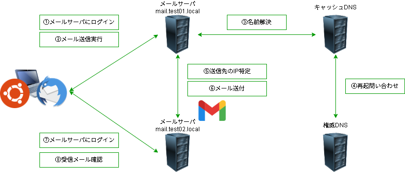

# 環境構築
## Ubuntu Desktopの環境整備
Thunderbirdを導入します。アプリセンターから導入が便利そうです。
ここからインストールするだけであとは何もせずに起動することが出来ます。
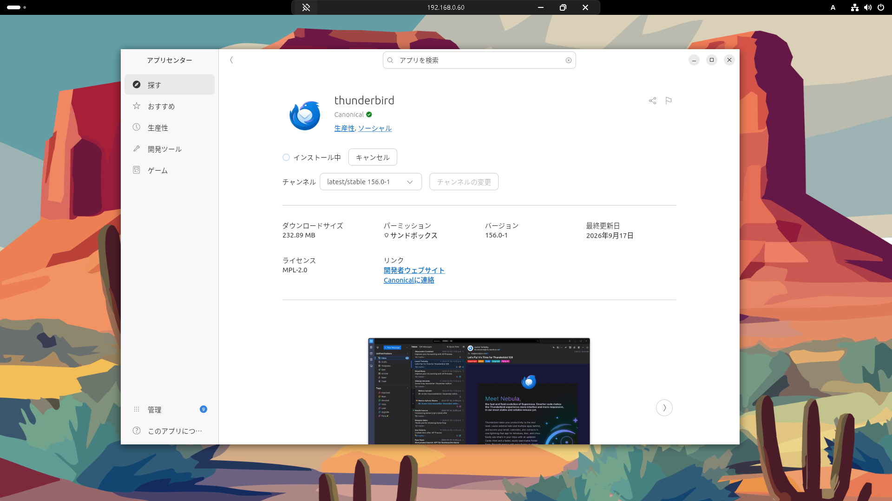

次にこのDesktopが参照するDNSをホームラボで作っているDNSに指定します。
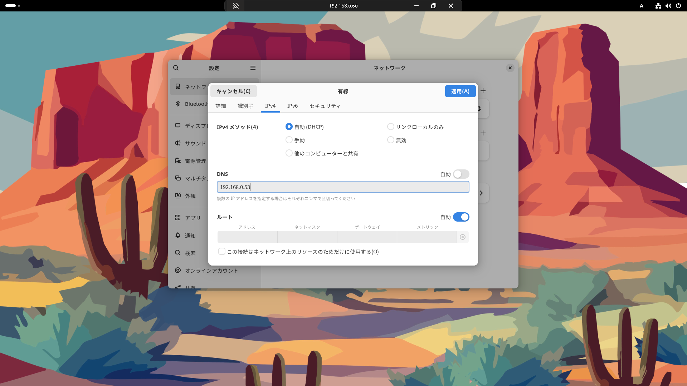

**mDNS (Multicast DNS) の無効化について**

.local ドメインは通常mDNSで使用される特別なドメインです。今回のように独自のDNSサーバで .local を管理する場合、systemd-resolved がmDNSとして処理しないよう明示的に無効化する必要があります。

変更箇所：
- `MulticastDNS=no` : mDNS機能を無効化
- `LLMNR=no` : Link-Local Multicast Name Resolution も無効化
- `DNSStubListener=no` : ローカルのスタブリスナーを無効化

これにより、.local ドメインのクエリが確実に指定したDNSサーバ（192.168.0.53）に送られます。
```
test@client:~$ sudo su -
[sudo] test のパスワード: 
root@client:~# cp -p /etc/systemd/resolved.conf /etc/systemd/resolved.conf.origin
root@client:~# sdiff  /etc/systemd/resolved.conf /etc/systemd/resolved.conf.origin 
#  This file is part of systemd.				#  This file is part of systemd.
#								#
#  systemd is free software; you can redistribute it and/or m	#  systemd is free software; you can redistribute it and/or m
#  terms of the GNU Lesser General Public License as publishe	#  terms of the GNU Lesser General Public License as publishe
#  Software Foundation; either version 2.1 of the License, or	#  Software Foundation; either version 2.1 of the License, or
#  any later version.						#  any later version.
#								#
# Entries in this file show the compile time defaults. Local 	# Entries in this file show the compile time defaults. Local 
# should be created by either modifying this file (or a copy 	# should be created by either modifying this file (or a copy 
# /etc/ if the original file is shipped in /usr/), or by crea	# /etc/ if the original file is shipped in /usr/), or by crea
# the /etc/systemd/resolved.conf.d/ directory. The latter is 	# the /etc/systemd/resolved.conf.d/ directory. The latter is 
# recommended. Defaults can be restored by simply deleting th	# recommended. Defaults can be restored by simply deleting th
# configuration file and all drop-ins located in /etc/.		# configuration file and all drop-ins located in /etc/.
#								#
# Use 'systemd-analyze cat-config systemd/resolved.conf' to d	# Use 'systemd-analyze cat-config systemd/resolved.conf' to d
#								#
# See resolved.conf(5) for details.				# See resolved.conf(5) for details.

[Resolve]							[Resolve]
# Some examples of DNS servers which may be used for DNS= and	# Some examples of DNS servers which may be used for DNS= and
# Cloudflare: 1.1.1.1#cloudflare-dns.com 1.0.0.1#cloudflare-d	# Cloudflare: 1.1.1.1#cloudflare-dns.com 1.0.0.1#cloudflare-d
# Google:     8.8.8.8#dns.google 8.8.4.4#dns.google 2001:4860	# Google:     8.8.8.8#dns.google 8.8.4.4#dns.google 2001:4860
# Quad9:      9.9.9.9#dns.quad9.net 149.112.112.112#dns.quad9	# Quad9:      9.9.9.9#dns.quad9.net 149.112.112.112#dns.quad9
DNS=192.168.0.53					      |	#DNS=
MulticastDNS=no						      <
LLMNR=no						      <
DNSStubListener=no					      <
#FallbackDNS=							#FallbackDNS=
#Domains=							#Domains=
#DNSSEC=no							#DNSSEC=no
#DNSOverTLS=no							#DNSOverTLS=no
#MulticastDNS=no						#MulticastDNS=no
#LLMNR=no							#LLMNR=no
#Cache=no-negative						#Cache=no-negative
#CacheFromLocalhost=no						#CacheFromLocalhost=no
#DNSStubListener=yes						#DNSStubListener=yes
#DNSStubListenerExtra=						#DNSStubListenerExtra=
#ReadEtcHosts=yes						#ReadEtcHosts=yes
#ResolveUnicastSingleLabel=no					#ResolveUnicastSingleLabel=no
#StaleRetentionSec=0						#StaleRetentionSec=0

```

修正を反映するために、再起動します。
```
root@client:~# systemctl restart systemd-resolved
```

## メールサーバの環境整備
今の状態だと証明書・認証・名前解決で問題があるので1つずつ対応していきます。
まずはPostfixの設定ファイルである/etc/postfix/master.cfを修正します。両方のメールサーバで以下の設定を行っていきます。
smtpd_tls_security_level=none に変更したり-o smtpd_relay_restrictions=permit_sasl_authenticated,rejectにしたり、submissionでコメントアウトされているものを外して有効にしたりします。
```
root@multi-server:~# cp -p /etc/postfix/master.cf /etc/postfix/master.cf.20260920
root@multi-server:~# nano /etc/postfix/master.cf
root@multi-server:~# diff /etc/postfix/master.cf /etc/postfix/master.cf.20260920
19,22c19,22
< submission inet n       -       y       -       -       smtpd
<   -o syslog_name=postfix/submission
<   -o smtpd_tls_security_level=none
<   -o smtpd_sasl_auth_enable=yes
---
> #submission inet n       -       y       -       -       smtpd
> #  -o syslog_name=postfix/submission
> #  -o smtpd_tls_security_level=encrypt
> #  -o smtpd_sasl_auth_enable=yes
33,35c33,35
<   -o smtpd_relay_restrictions=permit_sasl_authenticated,reject
<   -o smtpd_recipient_restrictions=permit_sasl_authenticated,reject
<   -o milter_macro_daemon_name=ORIGINATING
---
> #  -o smtpd_relay_restrictions=
> #  -o smtpd_recipient_restrictions=permit_sasl_authenticated,reject
> #  -o milter_macro_daemon_name=ORIGINATING
```

修正が出来ましたら、Postfixを再起動します。
```
root@multi-server:~# systemctl restart postfix
```

また、/etc/postfix/main.cfのSASLについても修正します。
**SASL認証について**
SASL (Simple Authentication and Security Layer) はメール送信時のユーザ認証機構です。

なぜ必要か：
Thunderbirdなどのメールクライアントがメールを送信（SMTP）する際、正当なユーザであることを証明するために認証が必要です。これがないと、ThunderbirdからのSMTP接続が拒否されます。

設定のポイント：
- PostfixがDovecotの認証ソケットを使用
- `/var/spool/postfix/private/auth` を通じて認証情報をやり取り
- submission ポート（587）で認証を要求
```
root@multi-server:~# cp -p /etc/postfix/main.cf /etc/postfix/main.cf.20260920
root@multi-server:~# nano /etc/postfix/main.cf
root@multi-server:~# diff /etc/postfix/main.cf /etc/postfix/main.cf.20260920
49,56d48
<
< # SASL認証設定
< smtpd_sasl_type = dovecot
< smtpd_sasl_path = private/auth
< smtpd_sasl_auth_enable = yes
< smtpd_sasl_security_options = noanonymous
< smtpd_sasl_local_domain = $myhostname
< broken_sasl_auth_clients = yes
```

続いて、Dovecotの認証ソケットの設定を行います。
```
root@multi-server:~# cp -p /etc/dovecot/conf.d/10-master.conf /etc/dovecot/conf.d/10-master.conf.20260920
root@multi-server:~# nano /etc/dovecot/conf.d/10-master.conf
```

/etc/dovecot/conf.d/10-master.conf内のservice authのセクションを以下のようにします。
```
service auth {
  # auth_socket_path points to this userdb socket by default. It's typically
  # used by dovecot-lda, doveadm, possibly imap process, etc. Users that have
  # full permissions to this socket are able to get a list of all usernames and
  # get the results of everyone's userdb lookups.
  #
  # The default 0666 mode allows anyone to connect to the socket, but the
  # userdb lookups will succeed only if the userdb returns an "uid" field that
  # matches the caller process's UID. Also if caller's uid or gid matches the
  # socket's uid or gid the lookup succeeds. Anything else causes a failure.
  #
  # To give the caller full permissions to lookup all users, set the mode to
  # something else than 0666 and Dovecot lets the kernel enforce the
  # permissions (e.g. 0777 allows everyone full permissions).
  unix_listener auth-userdb {
    #mode = 0666
    #user =
    #group =
  }

  # ← ここに追加
  unix_listener /var/spool/postfix/private/auth {
    mode = 0666
    user = postfix
    group = postfix
  }

  # Postfix smtp-auth
  #unix_listener /var/spool/postfix/private/auth {
  #  mode = 0666
  #}

  # Auth process is run as this user.
  #user = $default_internal_user
}
```

修正できましたら、dovecotを再起動します。
```
root@multi-server:~# systemctl restart dovecot
```

最後にメールサーバもホームラボの自作DNSへ名前解決するように設定します。
```
root@multi-server:~# nano /etc/resolv.conf
root@multi-server:~# cat /etc/resolv.conf | grep -i nameserver
nameserver 192.168.0.53
```

Ubuntu Desktopの環境整備のところでも修正しましたが、今回メールアドレスが*.localになるのでmDNSが働いてしまっております。同様に修正します。
```
root@multi-server:~# cp -p /etc/systemd/resolved.conf /etc/systemd/resolved.conf.origin
root@multi-server:~# nano /etc/systemd/resolved.conf
root@multi-server:~# sdiff /etc/systemd/resolved.conf /etc/systemd/resolved.conf.origin
#  This file is part of systemd.                                #  This file is part of systemd.
#                                                               #
#  systemd is free software; you can redistribute it and/or m   #  systemd is free software; you can redistribute it and/or m
#  terms of the GNU Lesser General Public License as publishe   #  terms of the GNU Lesser General Public License as publishe
#  Software Foundation; either version 2.1 of the License, or   #  Software Foundation; either version 2.1 of the License, or
#  any later version.                                           #  any later version.
#                                                               #
# Entries in this file show the compile time defaults. Local    # Entries in this file show the compile time defaults. Local
# should be created by either modifying this file (or a copy    # should be created by either modifying this file (or a copy
# /etc/ if the original file is shipped in /usr/), or by crea   # /etc/ if the original file is shipped in /usr/), or by crea
# the /etc/systemd/resolved.conf.d/ directory. The latter is    # the /etc/systemd/resolved.conf.d/ directory. The latter is
# recommended. Defaults can be restored by simply deleting th   # recommended. Defaults can be restored by simply deleting th
# configuration file and all drop-ins located in /etc/.         # configuration file and all drop-ins located in /etc/.
#                                                               #
# Use 'systemd-analyze cat-config systemd/resolved.conf' to d   # Use 'systemd-analyze cat-config systemd/resolved.conf' to d
#                                                               #
# See resolved.conf(5) for details.                             # See resolved.conf(5) for details.

[Resolve]                                                       [Resolve]
# Some examples of DNS servers which may be used for DNS= and   # Some examples of DNS servers which may be used for DNS= and
# Cloudflare: 1.1.1.1#cloudflare-dns.com 1.0.0.1#cloudflare-d   # Cloudflare: 1.1.1.1#cloudflare-dns.com 1.0.0.1#cloudflare-d
# Google:     8.8.8.8#dns.google 8.8.4.4#dns.google 2001:4860   # Google:     8.8.8.8#dns.google 8.8.4.4#dns.google 2001:4860
# Quad9:      9.9.9.9#dns.quad9.net 149.112.112.112#dns.quad9   # Quad9:      9.9.9.9#dns.quad9.net 149.112.112.112#dns.quad9
DNS=192.168.0.53                                              | #DNS=
MulticastDNS=no                                               <
LLMNR=no                                                      <
DNSStubListener=no                                            <
#FallbackDNS=                                                   #FallbackDNS=
#Domains=                                                       #Domains=
#DNSSEC=no                                                      #DNSSEC=no
#DNSOverTLS=no                                                  #DNSOverTLS=no
#MulticastDNS=no                                                #MulticastDNS=no
#LLMNR=no                                                       #LLMNR=no
#Cache=no-negative                                              #Cache=no-negative
#CacheFromLocalhost=no                                          #CacheFromLocalhost=no
#DNSStubListener=yes                                            #DNSStubListener=yes
#DNSStubListenerExtra=                                          #DNSStubListenerExtra=
#ReadEtcHosts=yes                                               #ReadEtcHosts=yes
#ResolveUnicastSingleLabel=no                                   #ResolveUnicastSingleLabel=no
#StaleRetentionSec=0                                            #StaleRetentionSec=0
```

再起動します。
postfixも再起動します。
```
root@multi-server:~# systemctl restart systemd-resolved
root@multi-server:~# systemctl restart postfix
```


## DNS周りの環境整備
今回メールアドレスはtest01.localとtest02.localになるので、これを名前解決できるようにDNSサーバの環境を整えます。私の環境ではキャッシュDNSにクエリが投げられた後、ルートDNS→TLD DNS→権威DNSというフローになるので、ルートDNSから順番に更新していきます。

Postfixのconfファイルでmyhostname = mail.test01.localやmyhostname = mail.test02.localという設定をしておりますが、名前解決をしてメールサーバにアクセスるときはここに記載されているドメインを名前解決できれば良いようなのでその点を考慮して環境整備していきます。

### ルートDNS 
/etc/bind/db.rootに対してlocalというドメインがどこで管理しているかの情報を追記します。
```
root@root-dns:~# cd /etc/bind
root@root-dns:/etc/bind# cp -p db.root db.root.20260920
root@root-dns:/etc/bind# nano db.root
root@root-dns:/etc/bind# sdiff db.root db.root.20260920
$TTL 86400                                                      $TTL 86400
@   IN  SOA     root-dns. admin.root. (                         @   IN  SOA     root-dns. admin.root. (
        2026092001                                            |         2026040403
        3600                                                            3600
        1800                                                            1800
        604800                                                          604800
        86400 )                                                         86400 )

    IN  NS      root-dns.                                           IN  NS      root-dns.

; com delegation                                                ; com delegation
com.    IN  NS  tld-dns.                                        com.    IN  NS  tld-dns.
                                                              <
; local delegation                                            <
local.  IN  NS  tld-dns.                                      <

; glue                                                          ; glue
root-dns.  IN  A   192.168.0.49                                 root-dns.  IN  A   192.168.0.49
tld-dns.   IN  A   192.168.0.50                                 tld-dns.   IN  A   192.168.0.50
```

bind9を再起動します。
```
root@root-dns:/etc/bind# systemctl restart bind9
```

## TLD-DNS
named.conf.localに名前解決の際に必要となるファイルを指定します。
今回はlocalというトップレベルドメインの名前解決の情報を新規ファイルdb.local.zoneファイルで管理するので、これを指定します。
```
root@tld-dns:~# cd /etc/bind
root@tld-dns:/etc/bind# cp -p named.conf.local named.conf.local.2026920
root@tld-dns:/etc/bind# vi named.conf.local
root@tld-dns:/etc/bind# sdiff named.conf.local named.conf.local.2026920
//                                                              //
// Do any local configuration here                              // Do any local configuration here
//                                                              //

// Consider adding the 1918 zones here, if they are not used    // Consider adding the 1918 zones here, if they are not used
// organization                                                 // organization
//include "/etc/bind/zones.rfc1918";                            //include "/etc/bind/zones.rfc1918";

zone "com" IN {                                                 zone "com" IN {
    type master;                                                    type master;
    file "/etc/bind/db.com";                                        file "/etc/bind/db.com";
};                                                              };
                                                              <
zone "local" IN {                                             <
    type master;                                              <
    file "/etc/bind/db.local.zone";                           <
};                                                            <
```

db.local.zoneファイルを作成します。
```
root@tld-dns:/etc/bind# vi db.local.zone
root@tld-dns:/etc/bind# cat db.local.zone
$TTL 86400
@   IN  SOA     tld-dns. admin.local. (
        2026092001
        3600
        1800
        604800
        86400 )

    IN  NS      tld-dns.

; test01.local delegation
test01.local.    IN  NS  auth-dns.test01.local.

; test02.local delegation
test02.local.    IN  NS  auth-dns.test02.local.

; glue
tld-dns.                  IN  A   192.168.0.50
auth-dns.test01.local.    IN  A   192.168.0.51
auth-dns.test02.local.    IN  A   192.168.0.51
```

bind9を再起動します。
```
root@tld-dns:/etc/bind# systemctl restart bind9
```

### 権威DNS
named.conf.localに名前解決の際に必要となるファイルを指定します。
今回はtest01.localというドメインとtest02.localというドメインの名前解決の情報を新規ファイルdb.test01.localとdb.test02.localファイルで管理するので、これを指定します。
```
root@auth-dns:~# cd /etc/bind/
root@auth-dns:/etc/bind# cp -p named.conf.local named.conf.local.20260920
root@auth-dns:/etc/bind# vi named.conf.local
root@auth-dns:/etc/bind# sdiff named.conf.local named.conf.local.20260920
//                                                              //
// Do any local configuration here                              // Do any local configuration here
//                                                              //

// Consider adding the 1918 zones here, if they are not used    // Consider adding the 1918 zones here, if they are not used
// organization                                                 // organization
//include "/etc/bind/zones.rfc1918";                            //include "/etc/bind/zones.rfc1918";

zone "example.com" IN {                                         zone "example.com" IN {
    type master;                                                    type master;
    file "/etc/bind/db.example.com";                                file "/etc/bind/db.example.com";
};                                                              };

zone "test01.local" IN {                                      <
    type master;                                              <
    file "/etc/bind/db.test01.local";                         <
};                                                            <
                                                              <
zone "test02.local" IN {                                      <
    type master;                                              <
    file "/etc/bind/db.test02.local";                         <
};                                                            <
                                                              <
```

それぞれのファイルを新規作成していきます。
まずはtest01.localドメインを管理するdb.test01.localファイルです。
```
root@auth-dns:/etc/bind# vi db.test01.local
root@auth-dns:/etc/bind# cat db.test01.local
$TTL 86400
@   IN  SOA     auth-dns.test01.local. admin.test01.local. (
        2026092001
        3600
        1800
        604800
        86400 )

    IN  NS      auth-dns.test01.local.

auth-dns   IN  A   192.168.0.51
mail       IN  A   192.168.0.73
@          IN  MX  10  mail.test01.local.
```

次にtest02.localドメインを管理するdb.test02.localファイルです。
```
root@auth-dns:/etc/bind# vi db.test02.local
root@auth-dns:/etc/bind# cat db.test02.local
$TTL 86400
@   IN  SOA     auth-dns.test02.local. admin.test02.local. (
        2026092001
        3600
        1800
        604800
        86400 )

    IN  NS      auth-dns.test02.local.

auth-dns   IN  A   192.168.0.51
mail       IN  A   192.168.0.32
@          IN  MX  10  mail.test02.local.
```

設定確認と動作確認を行います。
まずは各種confファイルのチェックをnamed-checkconfコマンドで実行。
問題なさそうであればbindの再起動を行います。
```
root@auth-dns:/etc/bind# named-checkconf
root@auth-dns:/etc/bind# named-checkzone test01.local /etc/bind/db.test01.local
zone test01.local/IN: loaded serial 2026092001
OK
root@auth-dns:/etc/bind# named-checkzone test02.local /etc/bind/db.test02.local
zone test02.local/IN: loaded serial 2026092001
OK
root@auth-dns:/etc/bind# systemctl restart bind9
```

## Desktop側で名前解決できるか確認
terminalを開きnslookupで名前解決できることを確認します。
サーバのIPアドレスがちゃんと返ってきておりますので、問題なさそうです。
```
test@client:~$ nslookup mail.test01.local
Server:		192.168.0.53
Address:	192.168.0.53#53

Non-authoritative answer:
Name:	mail.test01.local
Address: 192.168.0.73

test@client:~$ nslookup mail.test02.local
Server:		192.168.0.53
Address:	192.168.0.53#53

Non-authoritative answer:
Name:	mail.test02.local
Address: 192.168.0.32
```

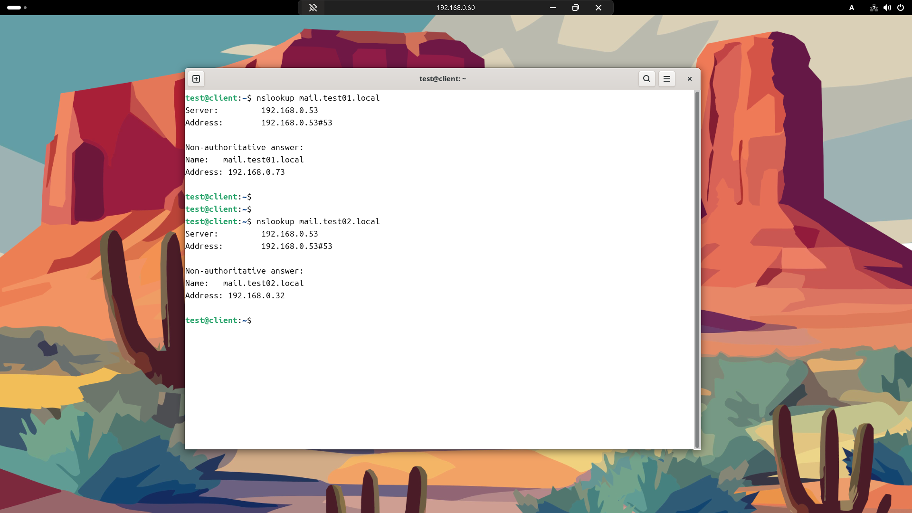

次にThunderbirdでそれぞれのメールアカウントにドメインでログイン出来ることを確認します。
ユーザ名：test
メールアドレス：test@test01.localと入力し続けるボタンを押下します。
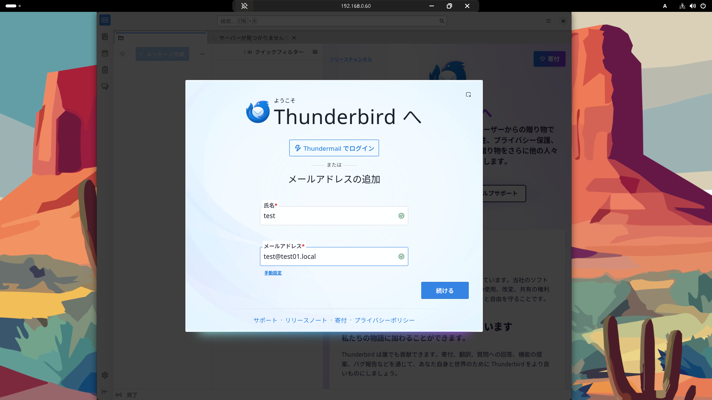

名前解決などの通信が問題なければ恐らく対象メールサーバでユーザが見つかり、後続の処理が走るはずです。
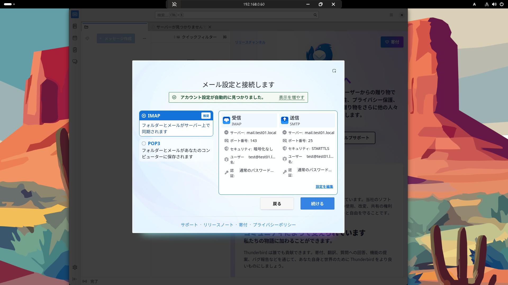

test01.localとtest02.localのメールアカウントにThunderboltでログイン出来ました。
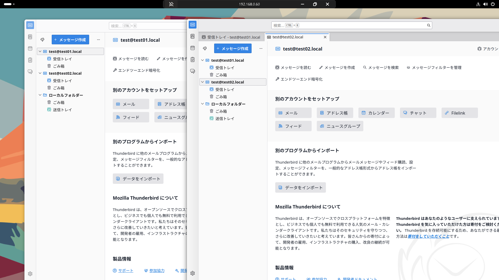

## メール送受信確認
それぞれのメールサーバにログインできましたので、送受信手素を行っていきたいと思います。
その前にThunderbirdでの設定を修正していきます。

まず送信サーバについて。
選択したサーバのポートが25になっています。これを587にします。
また、検証環境用に接続の保護をSTARTTLSからなしに変更します。
画面右の編集ボタンから編集することが出来ます。
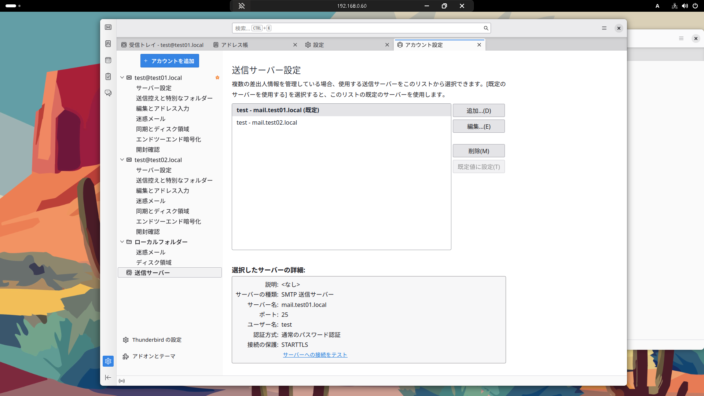

編集を実行すると、このように表記が変わります。
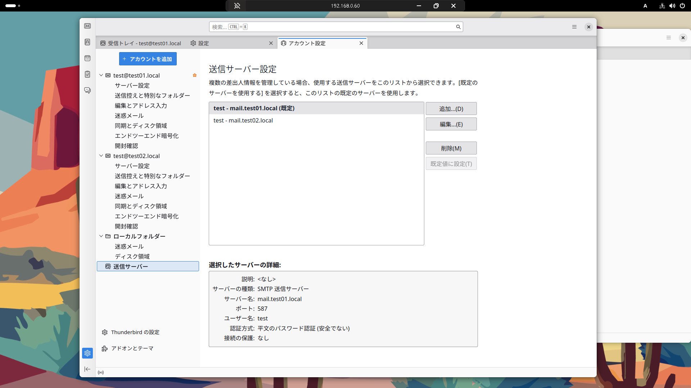


### test@test01.local⇒test@test02.localへの送付
画面左のtest01.local上のユーザからメールを送信し、test02.local上のユーザにメールが正常に飛んでいくことを確認します。
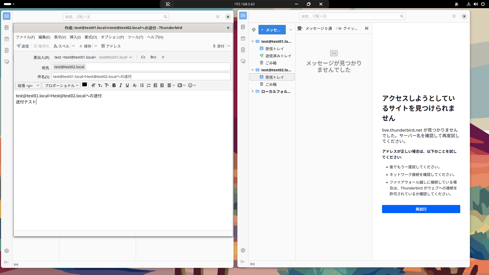

結果正常に送受信できていることがわかりました。
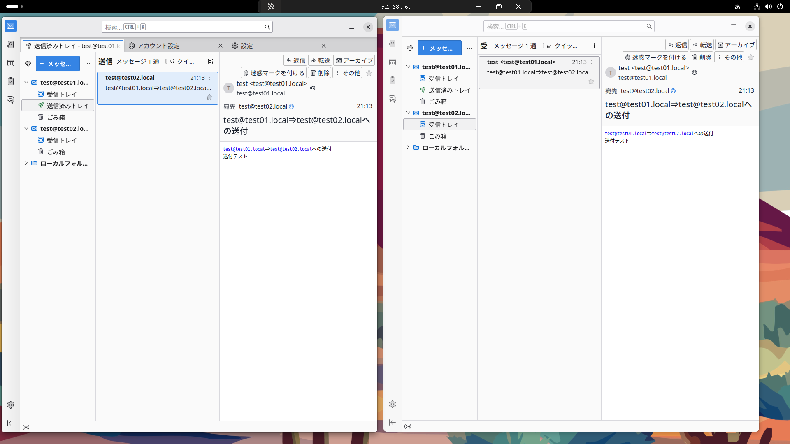

### test@test02.local⇒test@test01.localへの送付
今度は逆に、画面右のtest02.local上のユーザからメールを送信し、test01.local上のユーザにメールが正常に飛んでいくことを確認します。
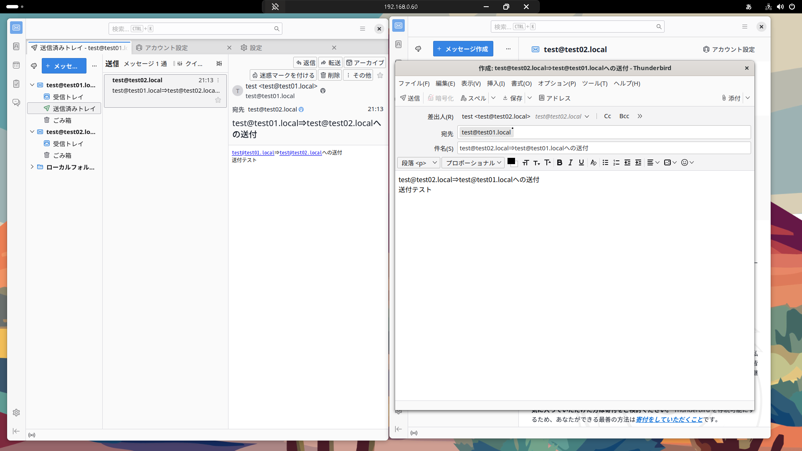

こちらも、結果正常に送受信できていることがわかりました。
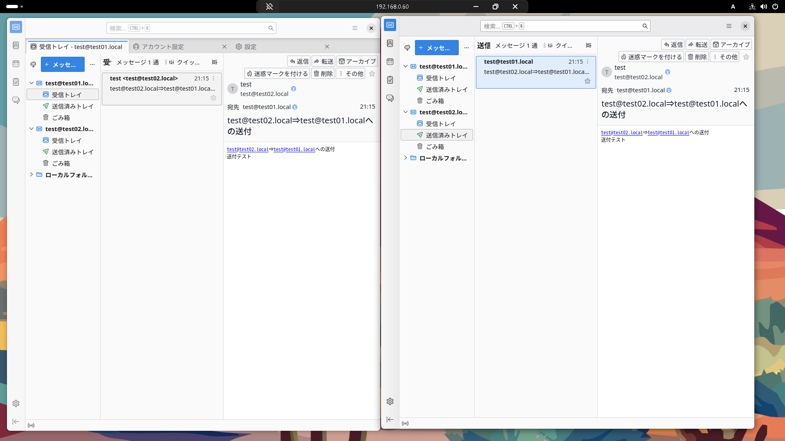


## まとめ

本記事では以下を実現しました：

✅ 自作DNS環境（ルート・TLD・権威）で .local ドメインの名前解決
✅ 2台のメールサーバ（test01.local / test02.local）の構築
✅ SASL認証によるThunderbirdからの送信
✅ 異なるドメイン間でのメール送受信

### 学んだポイント
- mDNSと独自DNSの競合回避方法
- PostfixとDovecotの連携（SASL認証）
- MXレコードによるメール配送の仕組み
- submission ポート（587）の重要性

### 次のステップ
- TLS証明書の導入（Let's Encrypt）
- SPF/DKIM/DMARCの設定
- スパムフィルタ（SpamAssassin）の導入
- Webメール（Roundcube）の導入

