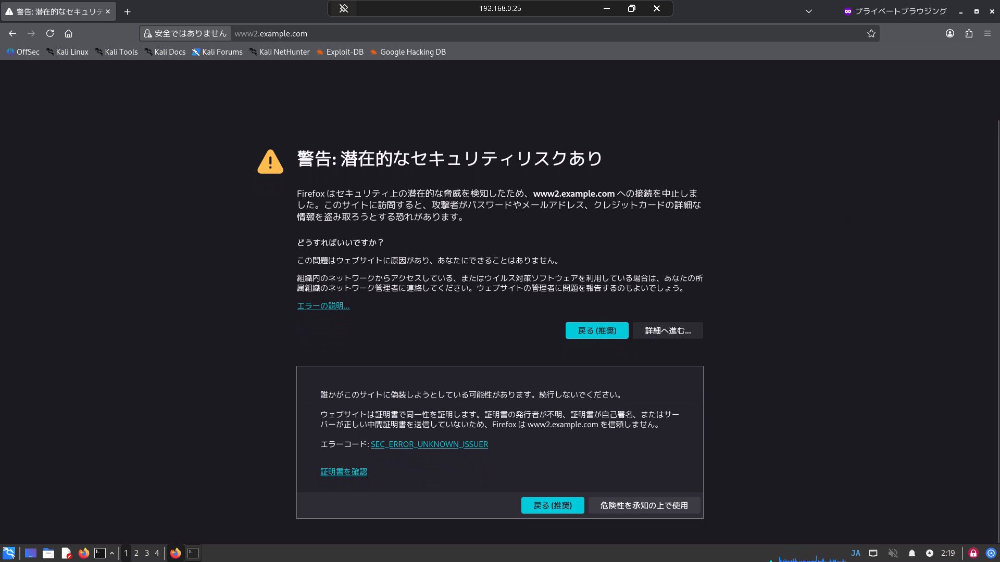
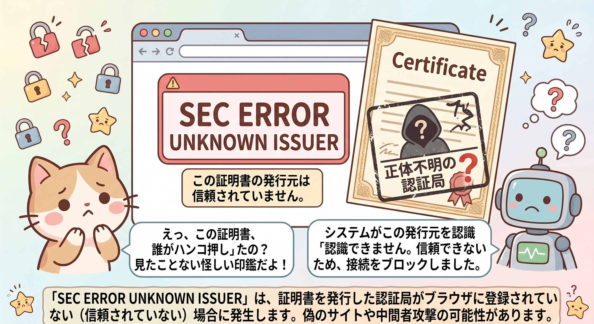
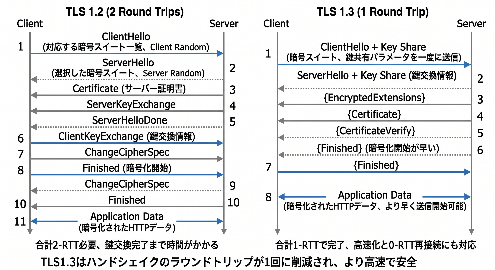
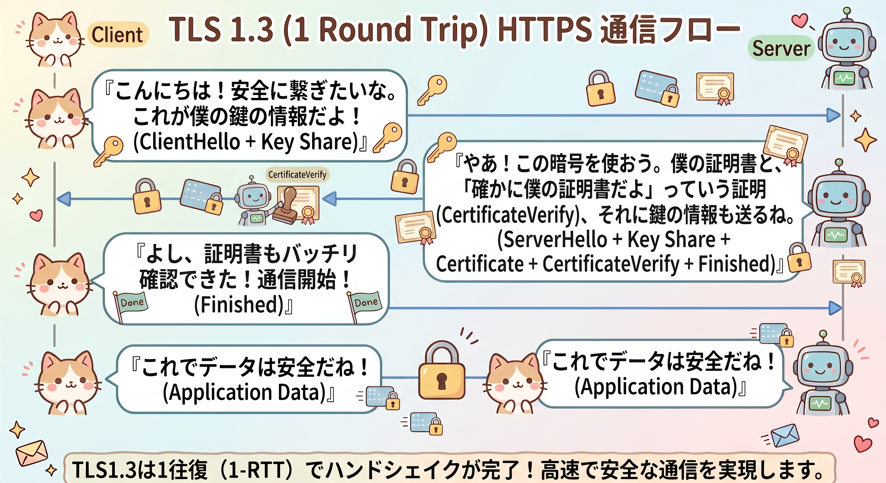
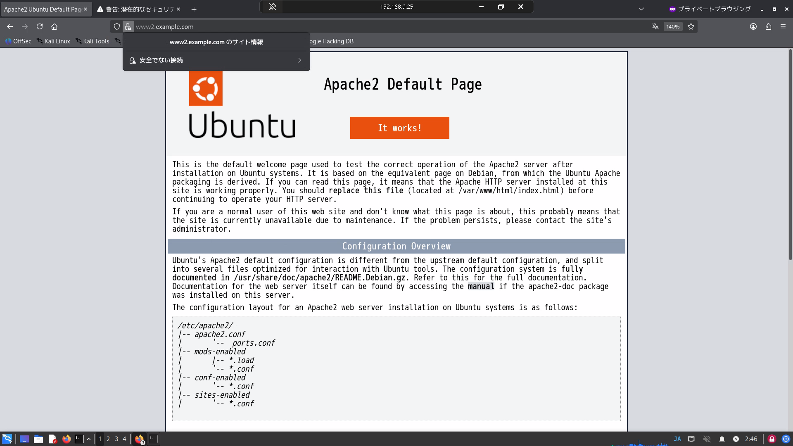
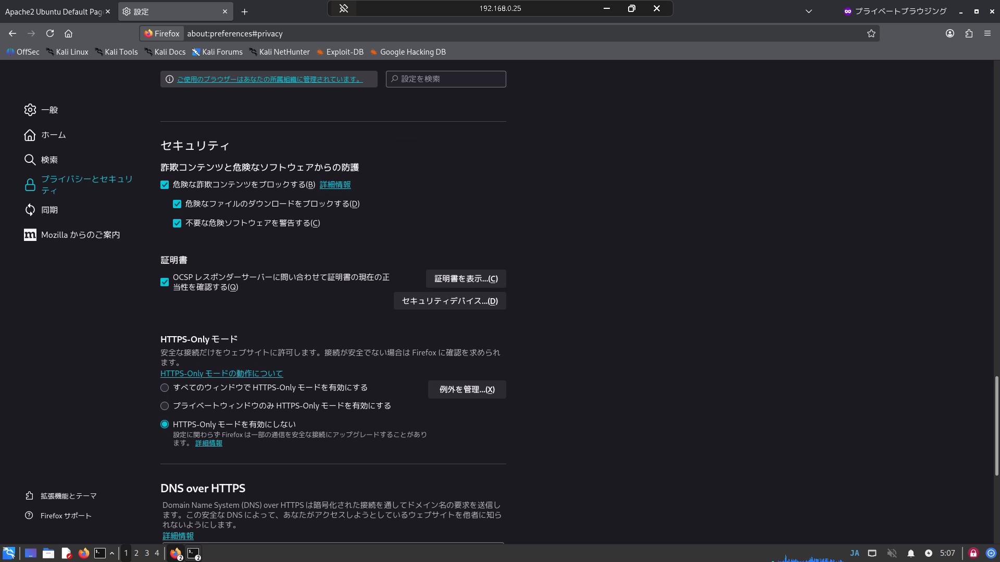
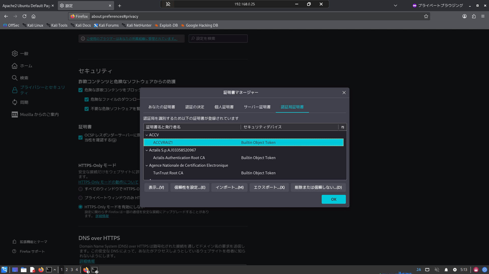
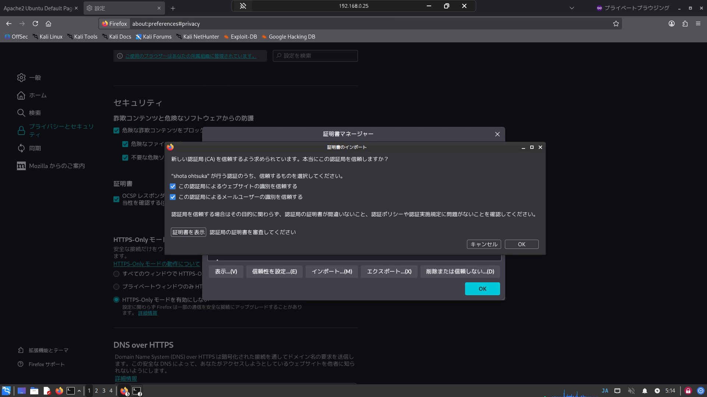
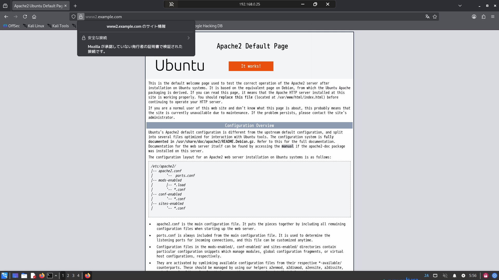

# はじめに
以前、以下の記事でプライベートCAを構築し、ApacheのサーバーをそのプライベートCAが発行した証明書でHTTPS化しました。この流れで、プライベートCAで署名したサーバ証明書を使っていても警告を発生させない流れや、なぜ発生するのかという事を備忘でまとめていきたいと思います。

[[openssl-private-ca]]

[[apache2-https-server-certificate]]

# 前提：プライベートCAの証明書を使っているサーバにアクセスすると
エンジニアとして働いているとよく見る（？）光景だと思いますが公に信頼されていないプライベートCAの証明書を使っているWebサイトにアクセスすると以下のような画面が表示されます。
Web画面にも"SEC ERROR UNKNOWN ISSUER"書いている通り、信頼されていない認証局が証明書を発行しているという警告を出しています。




この警告が出ているタイミングで、クライアントはサーバが使っている証明書（公開鍵付）を受け取っており、暗号化通信を開始しています。この警告は暗号化通信をするにあたり必要な公開鍵を証明している証明元がおかしいという事を示しています。

少しだけ深ぼっていくと、下記通信フロー図の右側にあるTLS1.3の1〜4番（ClientHello+Key Share → ServerHello+Key Share → {EncryptedExtensions} → {Certificate}）まで進んだ時点で証明書を受け取るのですが、Clientが使用しているWebブラウザが証明書の発行元を確認して世間一般に認知されていない発行機関が発行しているのを確認して「これは本当に大丈夫なサイトか？」という事を訴えてあの警告画面を表示しているという話の様です。
情報セキュリティで言うと真正性に該当する部分です。

少し脱線しますが、Certificateの下にCertificate Verifyがありますが、Verify（検証するという意味）なので矢印がサーバからクライアントに向いているのはおかしくないかと感じました。しかし、どうやらこの通信で【サーバからクライアントに対して自分は本当にこの証明書の持ち主です】という事を証明するためのデータ（これより前のやり取り全体のハッシュ値に対してサーバの秘密鍵で署名したもの）を渡しているようで、これをクライアントは、Certificateで受け取った公開鍵を使って、この署名を検証しています。なのでこの向きで良いようです。





Firefoxに表示されている危険性を承知の上で使用を押下すると、相手のWebサーバと暗号化通信をした上でサイトをブラウジングします。クライアント-サーバ間で通信暗号化は出来ております。
再三になりますが、証明書を発行している発行元が信頼できない状態なので通信相手が100%間違いないという事に対して確証が持てない場合機密情報等は入力しない方が良いでしょう。


# 対応：プライベートCAの証明書を信頼できるものとして証明書ストアに登録する
「このサーバ大丈夫か」という事をブラウザ側で表示させないようにする、つまりプライベートCAは信頼して大丈夫だという事を教えます。

CAから証明書を持ち出して、ブラウジングしている端末・VMへ持っていきます。
今回はこのca-cert.pemというファイルが証明書になります。
openssl x509コマンドでパースすることが出来ることからもこちらが証明書という事がわかります。
```
root@CA:/etc/ssl/demoCA# ls -ltr
total 12
-rw------- 1 root root 1874 Sep 19 14:49 ca-key.pem
-rw-r--r-- 1 root root 1419 Sep 19 14:52 ca-cert.pem
-rw-r--r-- 1 root root   41 Sep 19 15:18 ca-cert.srl

root@CA:/etc/ssl/demoCA# openssl x509 -in ca-cert.pem -text -noout
Certificate:
    Data:
        Version: 3 (0x2)
        Serial Number:
            26:dc:28:45:7c:fd:33:10:0b:11:xx:xx:xx:xx:xx:xx:xx:xx:xx:xx
        Signature Algorithm: sha256WithRSAEncryption
        Issuer: C = JP, ST = Tokyo, L = Chuo, O = test, OU = test, CN = shota ohtsuka, emailAddress = shota@example.com
```

PythonでHTTPサーバを立ててクライアントからwgetしてもらいます。
```
root@CA:/etc/ssl/demoCA# cp -p ca-cert.pem /tmp
root@CA:/etc/ssl/demoCA# cd /tmp
root@CA:/tmp# python3 -m http.server 8000
Serving HTTP on 0.0.0.0 port 8000 (http://0.0.0.0:8000/) ...
```

クライアントでterminalを起動してwgetを実行。
ダウンロードできました。
```
$ pwd
/home/test
$ wget http://192.168.0.30:8000/ca-cert.pem
--2026-09-22 03:18:05--  http://192.168.0.30:8000/ca-cert.pem
192.168.0.30:8000 に接続しています... 接続しました。
HTTP による接続要求を送信しました、応答を待っています... 200 OK
長さ: 1419 (1.4K) [application/pem-certificate-chain]
`ca-cert.pem' に保存中

ca-cert.pem                               100%[====================================================================================>]   1.39K  --.-KB/s 時間 0s       

2026-09-22 03:18:05 (357 MB/s) - `ca-cert.pem' へ保存完了 [1419/1419]
```

Firefoxの場合、右上のハンバーガーメニュー > 設定 > プライバシーとセキュリティの流れで遷移して、下の方にスクロールすると証明書の項目があります。
証明書を表示を押下します。


認証局証明書のタブを開きます。インポートボタンを押下します。
その後エクスプローラが開くので、プライベートCAからダウンロードした証明書を指定します。


信頼するかのウィザードが表示されるので、ウェブサイトとメールユーザを信頼するように指定します。
指定した後OKを押して証明書の画面を閉じます。


Firefoxのタブを全部閉じて改めて接続すると警告が出ずに画面が表示されるはずです。
注意としてMozillaが承認していない発行者の証明書で検証された接続ですと出ていますが、これはユーザで勝手にプライベートCAを証明書ストアに登録したのが原因です。
※もしこの時点でSSL_ERROR_BAD_CERT_DOMAINが出た場合は、末尾の備忘を参照してください


# 備忘：SSL_ERROR_BAD_CERT_DOMAINエラー
Webブラウジングをしている時に、SSL_ERROR_BAD_CERT_DOMAINというエラーコードではじかれたことがありました。これはSAN（Subject Alternative Name）がついてない状態でサーバ証明書を作ってしまったのが問題の様です。プライベートCAでサーバ証明書を作成して、それをWebサーバに噛ませる場合はSANは作っておいた方が間違いなく良いでしょう・・・

ザクッとした流れだけ書くと以下のような形でサーバ証明書を作成して適用します。
san.cnf作成→CSR再作成→CA側で-copy_extensions copy付きで再署名→Apacheに反映


